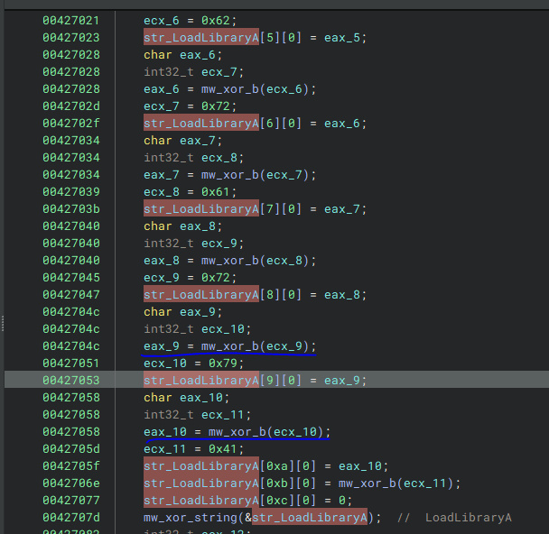
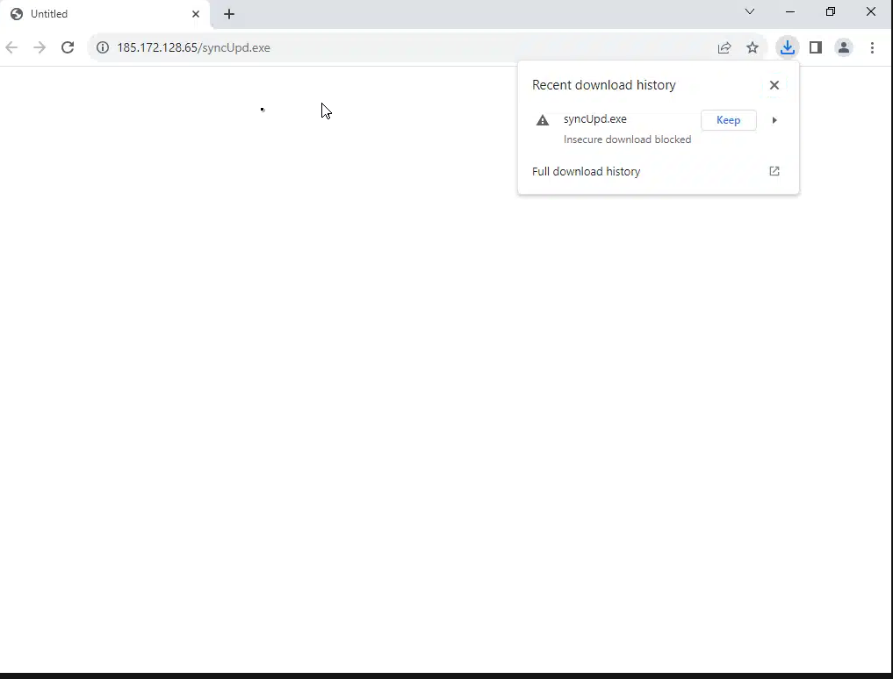
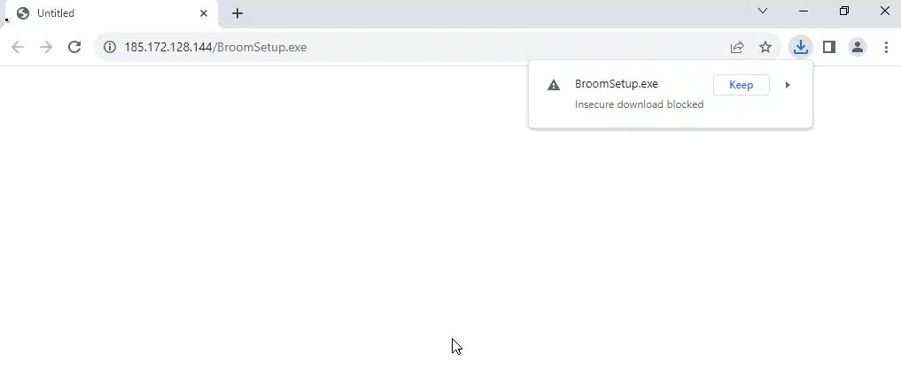

# Sample Information

Packed

| SHA256|
|---------------------------------------------------------------------------------|
|0918a0e9939f235924a5fb65284c97efff83f871bc1851c7e61b1b9800512885 |


Unpacked

| SHA256|
|---------------------------------------------------------------------------------|
|931309bc4cca2b42beae4a162c200bf76dc5a3dba9980f93d7959dc1001b9c |

# Analysis

i found the sample initially on malware bazaar, and wanted to try out BinaryNinja and its API. 
Luckily I found this sample with simple stack strings, so I could practise the base usage of some of the API, like going through code and instructions.
There is probably a better way to write some of the code, but the API is very new to me.
## Stack Strings With Binary Ninja API

Most of the stack strings are fetched from a single initial function. Hex values are pushed into memory locations. Two functions are called which cancel each other out. They simply +5 and xor by 0x13 and the other does the inverse. In the end, the hex values are the characters that will be concatenated to form a string.
Let's call them:
* mw_xor_b
* mw_xor_string

mw_xor_b is called on each single hex byte,and saved to sequential memory block.
mw_xor_string is finally called on the pointer to the start of the memory block.

The two functions help build out a pattern which looks something like this:

mw_xor_b(location)
mw_xor_b(location+1)
mw_xor_b(location+2)
mw_xor_string(&location)



Using the BinaryNinja API, the script will go through all the basic blocks of the .text section, identify all the single hex bytes that are before any call to mw_minus5xor.
This is because we know once mw_minus5xor is called the string is complete in memory.

This gives us all the strings and the relevant locations in the code.
From here things are as simple as just reading through the code.

The script is in the folder "Scripts".

Note: the the variables are called "decrypted" "encrypted" the string here at encrypted at all but as mentioned are just hex values. Initially I though they were and was too lazy to change the var names.


Strings:

```
[Default] /cpa/ping.php?substr=%s&s=ab&sub=%s
[Default] 185.172.128.90
[Default] one
[Default] two
[Default] three
[Default] four
[Default] five
[Default] six
[Default] seven
[Default] eight
[Default] nine
[Default] ten
[Default] SOFTWARE\BroomCleaner
[Default] Installed
[Default] 1
[Default] 185.172.128.65
[Default] /ping.php?substr=%s
[Default] 185.172.128.65
[Default] /syncUpd.exe
[Default] 185.172.128.144
[Default] /BroomSetup.exe
[Default] HTTP/1.1 200 OK
[Default] Content-Length
[Default] Transfer-Encoding
[Default] chunked
[Default] : 
[Default] 
[Default] POST 
[Default] GET 
[Default]  HTTP/1.1
[Default] Host: 
[Default] User-Agent: 
[Default] Mozilla/5.0 (Windows NT 10.0; Win64; x64) AppleWebKit/537.36 
[Default] (KHTML, like Gecko) Chrome/122.0.6261.129 Safari/537.36
[Default] Content-Length: 
[Default] LoadLibraryA
[Default] Kernel32.dll
[Default] GetProcAddress
[Default] ExitProcess
[Default] GetLastError
[Default] CreateFileA
[Default] WriteFile
[Default] User32.dll
[Default] GetModuleFileName
[Default] MoveFileA
[Default] Sleep
[Default] CloseHandle
[Default] CreateDirectoryA
[Default] WaitForSingleObject
[Default] msvcrt.dll
[Default] memcpy
[Default] Shell32.dll
[Default] ShellExecuteEx
[Default] SHGetFolderPathA
[Default] ws2_32.dll
[Default] WSAStartup
[Default] socket
[Default] gethostbyname
[Default] htons
[Default] connect
[Default] send
[Default] recv
[Default] closesocket
[Default] WSACleanup

 ```


## C2 communication

There is one specific function which deals with interaction with the C2 server.
The function is called 4 times.
Each time, before the call some memory allocations take place for the parameters that need to be sent to the C2.
The code makes use of the API seen in the strings from the dll ws2_32.dll:

* WSAStartup
* socket
* gethostbyname
* htons
* connect
* send
* recv
* closesocket
* WSACleanup

The first time the malware proceeds to reach out to C2 (185.172.128.90) with URI:
* /cpa/ping.php?substr=%s&s=ab&sub=%s 

The second time it reaches to the C2 (185.172.128.65) with URI:
* ping.php?substr=%s 

And also sending out the following information:
* "SOFTWARE\BroomCleaner Installed 1"

The third time it calls the C2 (185.172.128.65) for a binary:
* syncUpd.exe

Last time it calls for the C2 (185.172.128.144) for another binary:
* BroomSetup.exe

## File execution

The files will be executed with ShellExecuteEx after some initial setups of structures necessary to sue the API call.
File is written to the temp folder with a temporary name, this is achieved with the inbuilt function _tmpnam_s.


## Downloaded Binaries

At time of analysis binaries were still up.
According to unpac.me category, these seem to be StealC binaries.
Below the links for both VT and unpac.me.


### synUpd.exe

| SHA256|
|---------------------------------------------------------------------------------|
|4ddb70f6593a3b8989c814b1cf9bc6607ee72c316685f904bf1e7014f87e85a2 |


* https://www.virustotal.com/gui/file/4ddb70f6593a3b8989c814b1cf9bc6607ee72c316685f904bf1e7014f87e85a2
* https://www.unpac.me/results/a5fcd9fc-dd3e-48e1-af52-79e836e2320d



### BroomSetup.exe

| SHA256|
|---------------------------------------------------------------------------------|
|4f07e1095cc915b2d46eb149d1c3be14f3f4b4bd2742517265947fd23bdca5a7 |

* https://www.virustotal.com/gui/file/4f07e1095cc915b2d46eb149d1c3be14f3f4b4bd2742517265947fd23bdca5a7
* https://www.unpac.me/results/6300fa43-b28f-4b89-adb8-dedb6d52c4f0




# References

* https://www.unpac.me/results/077f0c59-26e8-4bff-8032-a7a9db10bb81?hash=0918a0e9939f235924a5fb65284c97efff83f871bc1851c7e61b1b9800512885#/
* https://www.virustotal.com/gui/file/4f07e1095cc915b2d46eb149d1c3be14f3f4b4bd2742517265947fd23bdca5a7
* https://www.virustotal.com/gui/file/4ddb70f6593a3b8989c814b1cf9bc6607ee72c316685f904bf1e7014f87e85a2
* https://research.openanalysis.net/gcleaner/loader/debugging/encryption/opendir/2024/03/17/new-gcleaner.html
* https://www.unpac.me/results/a5fcd9fc-dd3e-48e1-af52-79e836e2320d
* https://www.unpac.me/results/6300fa43-b28f-4b89-adb8-dedb6d52c4f0