# Sample Information

Latrodectus caught my eye in the past week or so.
I checked for some fresh samples on MalwareBazaar and Unpac.me and found this one.
Also, once I started analyzing a realized that Proofpoint had already published a technical analysis and noticed my sample was pretty similar, at least the overall structure functionalty and some IOCs.

Still, I wanted to do my own analysis leveraging BinaryNinja API and also trying out some emulation with Dumpulator to extract the strings.

Unpacked Sample Hash:
d1e2e287c96c290e161c553d99a115e7d72f83f23c850621169a27cca936f51b


# CRC32 Hashed API resolving

Windows API are stored as CRC32 hashes inside the sample. The malware will build some tables with the decoded values.

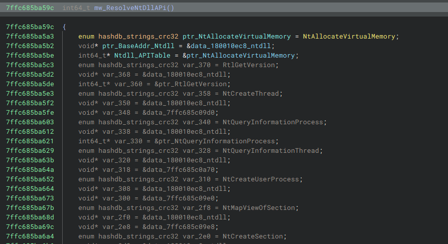

It will load the DLL components like kernel32.dll and ntdll.dll from the PEB (PEB walking).


Once the base address for a DLL is found, it will then loop through the functions to calculate the CRC32 hashes and compare them to the hardcoded values in the code.

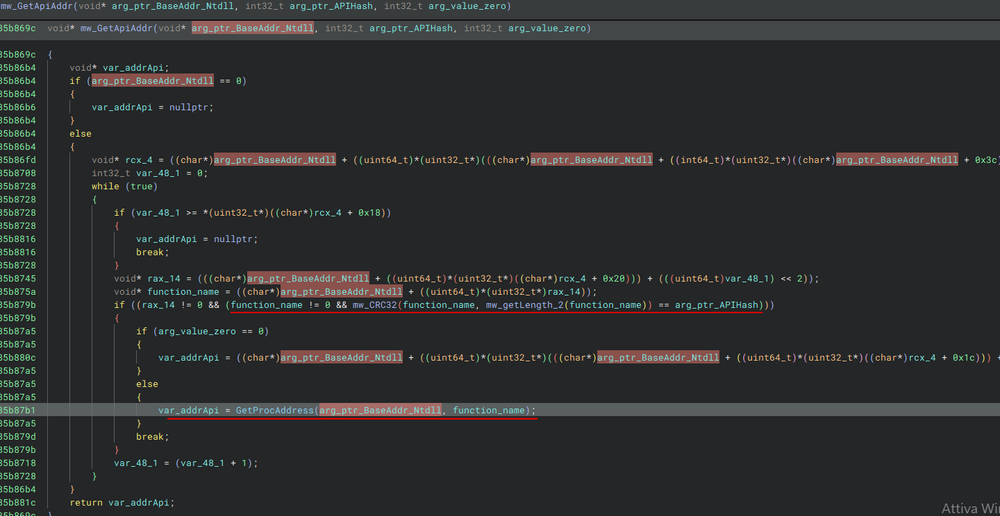

For the other DLLs such as user32.dll the process is a bit different.
The malware will call GetSystemDirectoryW to get the path to system32. Next it loops and calculates the CRC32 hashes of all the *.dll files found.
It compares them with the hardcoded values and loads the DLLs.

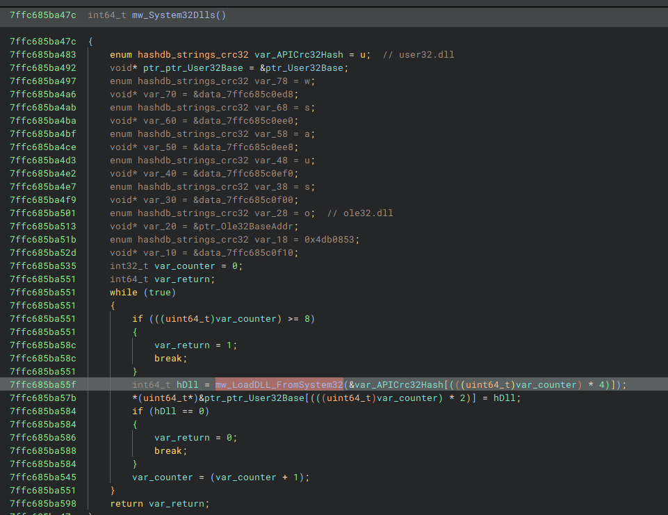

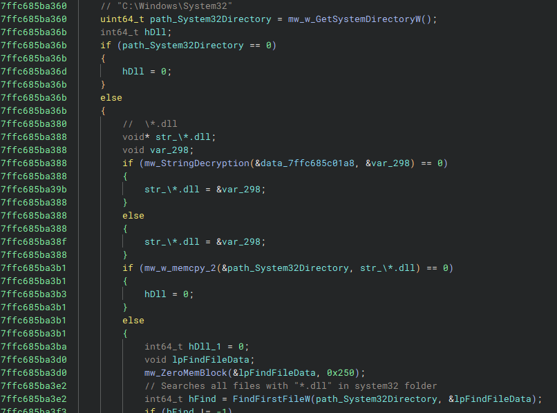

Now that all the base address of supporting DLLs are stored, the resolving function can loop through each and do the same as before.

Following the code block responsible for the API resolving functions:


# String Encryption

For this sample I did not bother to reverse the logic of the encryption nor build a python script to replicate the funcitonality.

At a first glance it performs a bunch of mathematical and logical operations to some data and drops the output.

The function takes two parameters:
* Address to data
* Outputbuffer

With this in mind it was sort of easy to perform some emulation.


For this we need a list of addresses from the .data section which have the encrypted values and the location from where the function is called each time.

I used jupyter notebook for this which I will add the the repo. 
You can also view the notebook here:
* https://nbviewer.org/github/VenzoV/MalwareAnalysisReports/blob/main/Latrodectus/Jupyternotes/Latrdectus_DecryptStrings.ipynb

With the following BinaryNinja API we can get the two lists we need:
``` 
addresses = []
locations = []

for ref in current_function.caller_sites:
	addresses.append(ref.hlil.params[0])
	locations.append(ref.address)

The we can run the following:

addr=0x7ffc685bae78
addresses = [...]
locations = [...]
i = 0
for entry in addresses:
    buffers = dp.allocate(1000)
    dp.call(addr, [entry ,buffers])
    decrypted_strings = dp.read(buffers, 1000)
    print("bv.set_comment_at(",hex(locations[i]),",\"",decrypted_strings.decode('utf-8').replace('\"','').replace('\\','\\\\'),"\")")
    i += 1
 ```

This will decrypt all the strings, and also I ran the a different print statement to generate the API to place comments. 
So with a simple copy & paste into the console I place comments of all the decrypted strings at the appropriate place.
``` 
print("bv.set_comment_at(",hex(locations[i]),",\"",decrypted_strings.decode('utf-8').replace('\"','').replace('\\','\\\\'),"\")")
 ```

 This essentially takes care of all the string decryption.

Decrypted Strings:
``` 
Location: 0x7ffc685bf7e8 String:{
Location: 0x7ffc685bf7f0 String:"pid": 
Location: 0x7ffc685bf800 String:"%d",
Location: 0x7ffc685bf810 String:"proc": 
Location: 0x7ffc685bf820 String:"%s",
Location: 0x7ffc685bf830 String:"subproc": [
Location: 0x7ffc685bf848 String:]
Location: 0x7ffc685bf850 String:}
Location: 0x7ffc685bf8e0 String:&desklinks=[
Location: 0x7ffc685bf8f8 String:*.*
Location: 0x7ffc685bf908 String:"%s"
Location: 0x7ffc685bf918 String:]
Location: 0x7ffc685bf858 String:&proclist=[
Location: 0x7ffc685bf870 String:{
Location: 0x7ffc685bf878 String:"pid": 
Location: 0x7ffc685bf888 String:"%d",
Location: 0x7ffc685bf898 String:"proc": 
Location: 0x7ffc685bf8a8 String:"%s",
Location: 0x7ffc685bf8b8 String:"subproc": [
Location: 0x7ffc685bf8d0 String:]
Location: 0x7ffc685bf8d8 String:}
Location: 0x7ffc685bf000 String:/c ipconfig /all
Location: 0x7ffc685bf028 String:C:\Windows\System32\cmd.exe
Location: 0x7ffc685bf068 String:/c systeminfo
Location: 0x7ffc685bf090 String:C:\Windows\System32\cmd.exe
Location: 0x7ffc685bf0d0 String:/c nltest /domain_trusts
Location: 0x7ffc685bf108 String:C:\Windows\System32\cmd.exe
Location: 0x7ffc685bf180 String:/c nltest /domain_trusts /all_trusts
Location: 0x7ffc685bf1d0 String:C:\Windows\System32\cmd.exe
Location: 0x7ffc685bf148 String:/c net view /all /domain
Location: 0x7ffc685bf210 String:C:\Windows\System32\cmd.exe
Location: 0x7ffc685bf250 String:/c net view /all
Location: 0x7ffc685bf278 String:C:\Windows\System32\cmd.exe
Location: 0x7ffc685bf2d0 String:/c net group "Domain Admins" /domain
Location: 0x7ffc685bf320 String:C:\Windows\System32\cmd.exe
Location: 0x7ffc685bf360 String:/Node:localhost /Namespace:\\root\SecurityCenter2 Path AntiVirusProduct Get * /Format:List
Location: 0x7ffc685bf420 String:C:\Windows\System32\wbem\wmic.exe
Location: 0x7ffc685bf470 String:/c net config workstation
Location: 0x7ffc685bf4b0 String:C:\Windows\System32\cmd.exe
Location: 0x7ffc685bf4f0 String:/c wmic.exe /node:localhost /namespace:\\root\SecurityCenter2 path AntiVirusProduct Get DisplayName | findstr /V /B /C:displayName || echo No Antivirus installed
Location: 0x7ffc685bf640 String:C:\Windows\System32\cmd.exe
Location: 0x7ffc685bf680 String:/c whoami /groups
Location: 0x7ffc685bf6b0 String:C:\Windows\System32\cmd.exe
Location: 0x7ffc685bf2b8 String:&ipconfig=
Location: 0x7ffc685bf6f0 String:&systeminfo=
Location: 0x7ffc685bf708 String:&domain_trusts=
Location: 0x7ffc685bf720 String:&domain_trusts_all=
Location: 0x7ffc685bf740 String:&net_view_all_domain=
Location: 0x7ffc685bf760 String:&net_view_all=
Location: 0x7ffc685bf778 String:&net_group=
Location: 0x7ffc685bf790 String:&wmic=
Location: 0x7ffc685bf7a0 String:&net_config_ws=
Location: 0x7ffc685bf7b8 String:&net_wmic_av=
Location: 0x7ffc685bf7d0 String:&whoami_group=
Location: 0x7ffc685bf940 String:Custom_update
Location: 0x7ffc685bf920 String:Update_%x
Location: 0x7ffc685bf968 String:.dll
Location: 0x7ffc685bf978 String:.exe
Location: 0x7ffc685bf988 String:Updater
Location: 0x7ffc685bf9a0 String:"%s"
Location: 0x7ffc685bf9b0 String:
Location: 0x7ffc685bf9b8 String:rundll32.exe
Location: 0x7ffc685bf9d8 String:"%s", %s %s
Location: 0x7ffc685bfa00 String:runnung
Location: 0x7ffc685bfa18 String::wtfbbq
Location: 0x7ffc685bfaf0 String:front
Location: 0x7ffc685bfb00 String:/files/
Location: 0x7ffc685bfa38 String:%d
Location: 0x7ffc685bfa48 String:%s%s
Location: 0x7ffc685bfa58 String:files/bp.dat
Location: 0x7ffc685bfa70 String:%s\%d.dll
Location: 0x7ffc685bfa90 String:%d.dat
Location: 0x7ffc685bfaa8 String:%s\%s
Location: 0x7ffc685bfac0 String:init -zzzz="%s\%s"
Location: 0x7ffc685bfb10 String:Littlehw
Location: 0x7ffc685bfb38 String:.exe
Location: 0x7ffc685bfbe0 String:Mozilla/4.0 (compatible; MSIE 7.0; Windows NT 5.1; Tob 1.1)
Location: 0x7ffc685bfc60 String:Mozilla/4.0 (compatible; MSIE 7.0; Windows NT 5.1; Tob 1.1)
Location: 0x7ffc685bfb68 String:Content-Type: application/x-www-form-urlencoded
Location: 0x7ffc685bfba0 String:POST
Location: 0x7ffc685bfbb0 String:GET
Location: 0x7ffc685bfcf0 String:CLEARURL
Location: 0x7ffc685bfd00 String:URLS
Location: 0x7ffc685bfd10 String:COMMAND
Location: 0x7ffc685bfd20 String:ERROR
Location: 0x7ffc685bfd30 String:12345
Location: 0x7ffc685bfd40 String:counter=%d&type=%d&guid=%s&os=%d&arch=%d&username=%s&group=%lu&ver=%d.%d&up=%d&direction=%s
Location: 0x7ffc685bfdb0 String:counter=%d&type=%d&guid=%s&os=%d&arch=%d&username=%s&group=%lu&ver=%d.%d&up=%d&direction=%s
Location: 0x7ffc685bfe20 String:counter=%d&type=%d&guid=%s&os=%d&arch=%d&username=%s&group=%lu&ver=%d.%d&up=%d&direction=%s
Location: 0x7ffc685c0160 String:ABCDEFGHIJKLMNOPQRSTUVWXYZabcdefghijklmnopqrstuvwxyz0123456789+/
Location: 0x7ffc685c0250 String:https://titnovacrion.top/live/
Location: 0x7ffc685c0278 String:https://skinnyjeanso.com/live/
Location: 0x7ffc685bffe0 String:%s%d.dll
Location: 0x7ffc685c0018 String:%s%d.exe
Location: 0x7ffc685bff40 String:Mozilla/4.0 (compatible; MSIE 7.0; Windows NT 5.1; Tob 1.1)
Location: 0x7ffc685bffc0 String:<html>
Location: 0x7ffc685bffd0 String:<!DOCTYPE
Location: 0x7ffc685c02a0 String:AppData
Location: 0x7ffc685c02b8 String:Desktop
Location: 0x7ffc685c02d0 String:Startup
Location: 0x7ffc685c02e8 String:Personal
Location: 0x7ffc685c0300 String:Local AppData
Location: 0x7ffc685c0330 String:Software\Microsoft\Windows\CurrentVersion\Explorer\Shell Folders
Location: 0x7ffc685c00e8 String:&mac=
Location: 0x7ffc685c00f8 String:%02x
Location: 0x7ffc685c0108 String::%02x
Location: 0x7ffc685c0128 String:;
Location: 0x7ffc685c0130 String:&computername=%s
Location: 0x7ffc685c0148 String:&domain=%s
Location: 0x7ffc685c0220 String:\Registry\Machine\
Location: 0x7ffc685c01e0 String:%04X%04X%04X%04X%08X%04X
Location: 0x7ffc685c01a8 String:\*.dll
Location: 0x7ffc685bfe90 String:C:\WINDOWS\SYSTEM32\rundll32.exe %s,%s
Location: 0x7ffc685bfef0 String:C:\WINDOWS\SYSTEM32\rundll32.exe %s
Location: 0x7ffc685bfff8 String:12345
Location: 0x7ffc685c0008 String:&stiller=
Location: 0x7ffc685c0030 String:LogonTrigger
Location: 0x7ffc685c0118 String:PT0S
Location: 0x7ffc685c03b8 String:\update_data.dat
Location: 0x7ffc685c03f0 String:URLS
Location: 0x7ffc685c0400 String:URLS|%d|%s
 ```
# BOT ID

Malware gets the volume serial number of the host with GetVolumeInformationW.
Serial number goes through a function that will perform an arbitrary multiplication with a hard-coded value 0x19660d (this value seems consistent and used in other campaigns also).

Returned result is then used as a part of the DLL filename appended after “Update_” as 8 hexadecimal characters.
It goes through other functions that perform some rotations and bitwise operations.

It decrypts the campaign ID and calculates the FNV hash of the string "Littlehw".

The final part of the this big function block will essentially do two things:
- Extract the arguements from the command-line of the process of the malware
* Check the file extension.

It will achieve this through a series of calls to NtQueryInformationProcess & ReadProcessMemory.

With NtQueryInformationProcess it will fetch the bytes ahead of the PROCESS_BASIC_INFORMATION to have access to a pointer to the PEB.


``` 
typedef struct _PROCESS_BASIC_INFORMATION {
    NTSTATUS ExitStatus;
    PPEB PebBaseAddress;
    ULONG_PTR AffinityMask;
    KPRIORITY BasePriority;
    ULONG_PTR UniqueProcessId;
    ULONG_PTR InheritedFromUniqueProcessId;
} PROCESS_BASIC_INFORMATION;
 ```

With a series of offsets to RSP the malware accesses the pointer and reads into a new memory buffer the contents of the pointer PPEB PebBaseAddress.

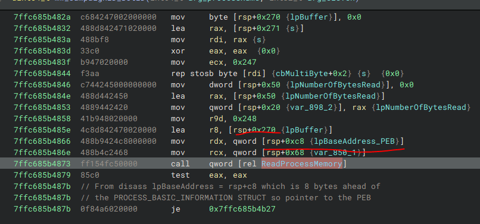

Now it has the PEB information loaded in memory, and again with appropriate offsets it will access _RTL_USER_PROCESS_PARAMETERS (0x20)

From this struct it will get the string stored in the member Command-line of  _RTL_USER_PROCESS_PARAMETERS (0x70).
Note the location of the actual string from the struct will be at 0x78.


``` 
_UNICODE_STRING CommandLine;  

//0x10 bytes (sizeof)
struct _UNICODE_STRING
{
    USHORT Length;                                                          //0x0
    USHORT MaximumLength;                                                   //0x2
    WCHAR* Buffer;                                                          //0x8 
}; 
 ```

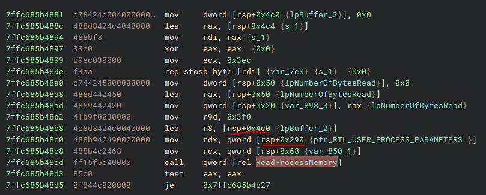


Now it has the command-line run, and using a custom function and hard-coded tokens to seek such as "commas or spaces" it will parse the information it needs including the file name.
The values are stored in some memory registers that will be later checked as "flags" in the C2 communication functions such as if the extension is exe or dll.

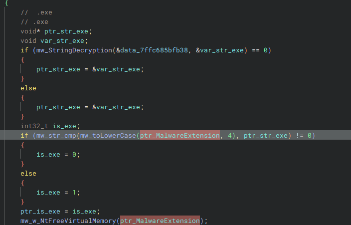

# C2 Table

The first URLs are decrypted using the method mentioned and are set in a global C2 table.
This table stores and pointer to memory address of decrypted C2.

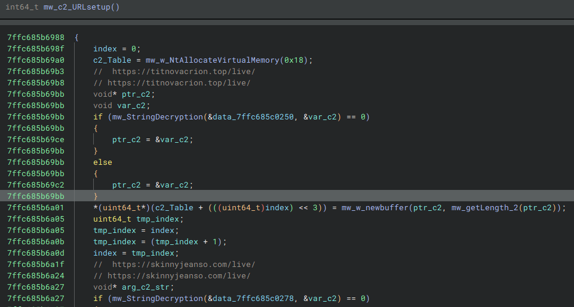

# Reading update_data.dat

The malware relies on this support file to extract other URLs.
The file is rc4 encyrpted.
The file read is located in the "%appdata%\Custom_update\" path.
This string is built by getting the value of APPDATA entry in the SHELL FOLDERS registry.

* It gets the user SID with RtlFormatCurrentUserKeyPath.
* It will use the API NtOpenKey & NtQueryValueKey to get the value of the shell folders reg key of Appdata:
	* REGISTRY\USER\SID\SOFTWARE\MICROSOFT\WINDOWS\CURRENTVERSION\EXPLORER\SHELL FOLDERS\APPDATA


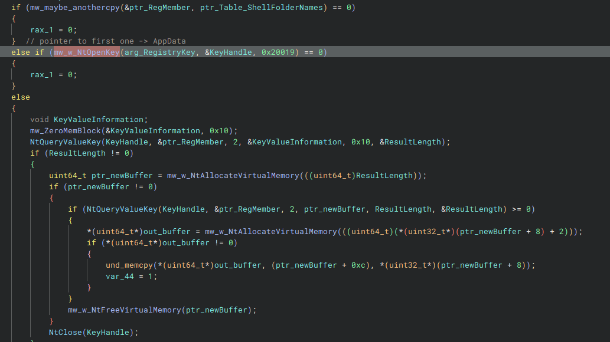

Once it has the file path it will read the data and call a RC4 decryption routine.
It will now parse each new line and look for the string "URLS" and "|".
Based on the proofpoint research we can see this is to fetch further URLs and saves them in the global list of C2.

Using a custom struct the code can be cleaned:


# CreateExecutable payload

The next function creates the following file:

* AppData\\Roaming\\Custom_update\\Update_33b0dade.dll\\exe

The extension is based on the previous checks mentioned and the number is randomly generated again using the serial volume name.
If file is already present or unable to create then a flag is set to 1,
otherwise to 2.
This flag is used later in the newly created thread and differentiates which the URL to where the victim data is sent.
More on this later.

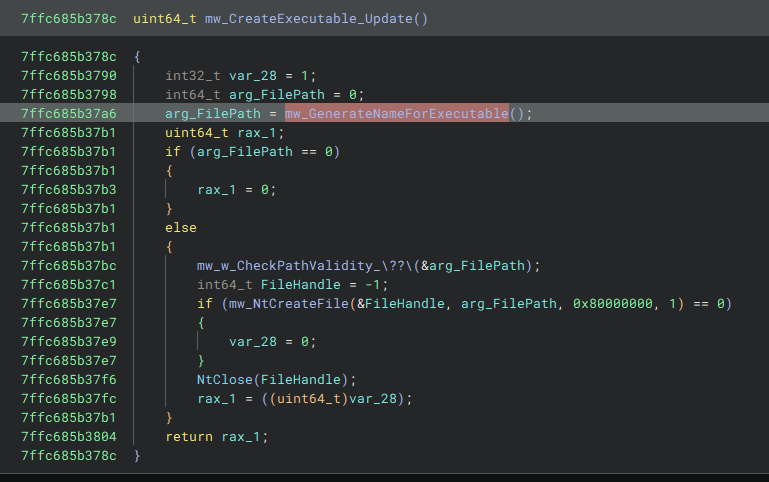

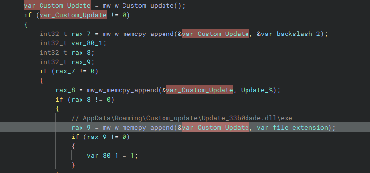

# COM persistence

The malware will now register a COM object. It will build the string:

* rundll32.exe [PARAMS]

Where PARAMS depends on if the file was identified as  .exe or .dll previously.
For example if it is .dll it will build:
* rundll32.exe [PATHDLL] , [EXPORT]


These values are then passed to the COM registration function.
The API used are:
* CoInitializeEx()
* CoCreateInstance()

Following the hardcoded values passed to CoCreateInstance():

``` 
riid = {9F36870F-E5A4-FC4C-BD3E-73E6154562DD}
clsid = {9F6870F-E5A4-4CFC-BD3E-73E6154562DD}
CLSCTX_INPROC_SERVER = 1
 ```


The malware will then reference the VTtable associated with the COM interface to set the LogonTrigger via Scheduled task named "Updater".

PT0S value is also given which will enable the task to run indefinitely. When this parameter is set to Nothing, the execution time limit is infinite.
Seemingly to run the built string at logon, thus creating persistence.


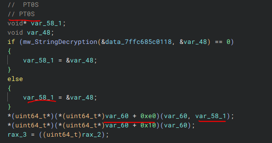
## New Thread

At one point the malware will create a new thread with hardcoded start location.
The code passed as argument will contain all the main functionality of the malware including C2 comms.
There is a longish sleep before as soon as entering the new thread:
- Malware will sleep for 30 minutes.
- 1000000 -> 1 second * 18000 (loop)


This section will decrypt the RC4 key: "12345"
Information collected is sent to C2 servers by encrypting and encoding with b64 same occurs with receiving data from the C2.


The info sent out initially looks something like this:
- "counter=%d&type=%d&guid=%s&os=%d&arch=%d&username=%s&group=%lu&ver=%d.%d&up=%d&direction=%s"


Data received from the C2 will have string format like so:

- CLEARURL
- URLS
- COMMAND
- ERROR


Proofpoint research has this with more details see references below.
But essentially the malware will parse out new C2 information commands and update C2 list.

# C2 commands

The Proofpoint research has already outlined the codes and functionality so I will not go over it again as it is the same.
There is 1 more function that is not covered as far as I have seen. The function is called with command ID 21.


This function seems to download a payload from the C2, it parses the HTML page likely to look for specific data.
Once the data is found it will copy the buffer location and create a new thread passing the response data as a 
parameter.


Interesting enough the malware will call on CreateFileMappingA MapViewOfFile.This can be used to execute a file without using
the Windows loader.
It then seems to update data pointer of the parameters passed to the thread to point to:
- "&stiller=pointer to start of mapped view"


# Refrences:
https://www.proofpoint.com/us/blog/threat-insight/latrodectus-spider-bytes-ice
https://www.unpac.me/results/caa90c35-0013-44bf-9a0b-ab969a222b83?hash=65da6d9f781ff5fc2865b8850cfa64993b36f00151387fdce25859781c1eb711#/
https://bazaar.abuse.ch/sample/65da6d9f781ff5fc2865b8850cfa64993b36f00151387fdce25859781c1eb711/
https://www.vergiliusproject.com/