## Sample Information

Packed

| SHA25 | SHA1 | MD5|
|---------|-------|------|
|DBDD22025131EEBE52EFC5FBE70E2E87723FF1934C808901BBB176F6130F23F6 | 66CBE1E120A28E812B265880406305E578560FFF |C859883A3D3889FF159A1DA8A815BD49 
 
Unpacked

| SHA25 | SHA1 | MD5|
|---------|-------|------|
|75CCCAE5F0B726F23DAA6BE69DD7C5E8FCD25A41C06191B84EB00EF945E5F7FA | F269DDFFA7A741C879D712D7009A112402AAA0B2 | 43C7F7F3BDCC56DFDCC02F351E31BCBE

## Introduction

Pikabot is a relatively new malware. It has been analyzed and reversed before ( see references).
This is my take and analysis on the updated version of the loader.
Earlier during the year the sample was smaller and also used different string encryption.
Stack strings are still used, but now RC4 is used to decrypt them.

Pikabot is divided into two modules, the loader and the core.
In this part we will take a look at the loader, which essentially has the job to load the core module which will be responsible for C2 communication.


## High level behavior

So before going into the details the sample will perform the following actions, and during the analysis below I will show case the assembly, decompiler and debugger evidence.

* The malware uses a lot of junk code to try to hinder analysis.
* Accesses the PEB to get handle to kernel32.dll to fetch LoadlLibraryA & GetProcAddress this will be used to dynamically load API.
* Strings, in particular the API names passed to the API resolving function, are encrypted using RC4. 
* The core module is decrypted from png files located in the resource section.
* Legitimate windows binary process is started, and core module is decrypted and injected into the process
* Malware uses indirect syscalls


## PEB access

The first function to analyze is the one responsible for fetching LoadlLibraryA  & GetProcAddress. To do this, the malware goes through the PEB to reach to get the base address of the kernel32.dll.

PEB structure is accessed, and the the code walks through InLoadOrderModuleList twice and finally reaches the third entry which is always kernel32.dll.
I have added references below to read more on PEB structure and how it can be used.


Once the module base for kernel32.dll is found, the two API can now be fetched. Two hashes are used and passed to a function which will resolve the API.
* 0xB89FB14B - GetProcAddress
* 0x7FA21D8F - LoadLibraryA


## RC4 Inline Decryption

Checking the sample, it uses RC4 to decrypt the strings. The malware uses "legit" strings for the keystream. We can receognize RC4 by typical  0x100 loops followed by another loop with XOR operation.
Below is what the code looks like.
Keep in mind that the malware uses a lot of junk code between the two loops and final decryption loop.
Also, the decryption happens in line and is not a function.
Both factors make static analysis bothersome, and emulation also bothersome.
The decrypted strings can be fetched all at once using the debugger and some conditional break points. I will add the full list below.
``` 
 do
  {
    v333[v3 + 24] = v3;
    ++v3;
  }
  while ( v3 < 0x100 );
  v4 = 0;
  v338 = 0xF;
  do
  {
    v5 = v333[v4 + 24];
    a1 = (a1 + *(dbg_key_rc4 + (v4 & 0xF)) + v5);
    v333[v4++ + 24] = v333[a1 + 24];
    v333[a1 + 24] = v5;
  }
  while ( v4 < 0x100 );
  v6 = v352;
  jj = 0;
  LOBYTE(v7) = 0;
  for ( i = 0; i < 12; ++i )
  {
    v345 = (v7 + 1);
    v9 = v333[v345 + 24];
    v352 = -339480793 * v6;
    jj = (v9 + jj);
    v333[v345 + 24] = v333[jj + 24];
    v333[jj + 24] = v9;
    v7 = (v7 + 1);
    v6 = v352;
    v312[i] = *(&encrypted_blob[2] + i) ^ v333[(v9 + v333[v7 + 24]) + 24];
  }
```


## Dynamic API resolving

The First analyzed function and the RC4 encryption method, both are the main core of the APi resolving function.
The function accepts two arguements:
* DLL flag -> this is just a numerical value that tells the function in which DLL the API is; 1: Kernel32.dll, 2: User32.dll, 3: ntdll.dll
* API name in cleartext

Whichever dll is used, the end result is always a jump to LABEL 88 seen below which peforms LoadLibraryA and GetProcAddress to retrieve the address of the API.


## Decrypted Strings

Setting two conditional break points on the API resolving function it is possible to have the debugger decrypt all the strings and log them.

* First breakpoint is at the start of the funciton when the decrypted string passed as argument is saved to a variable
* Second breakpoint is on the return, so we can read ESP to also get the return address and so we know on IDA where this value needs to be added as comment and rename functions. 

These are the parameters used for the conditional break point, the addresses refer to how may binary was rebased in IDA.
"##APICALL {utf8(edx)}" -> 0x6AB277B3
"##APICALL Address 0x{[esp]} "-> 0x6AB27F86


Output:
``` 
##APICALL HeapAlloc
##APICALL Address 0x6AB1ECFA
##APICALL LoadLibraryA
##APICALL Address 0x6AB1908A
##APICALL FreeLibrary
##APICALL Address 0x6AB190E3
##APICALL LoadLibraryA
##APICALL Address 0x6AB190FD
##APICALL FreeLibrary
##APICALL Address 0x6AB19246
##APICALL LoadLibraryA
##APICALL Address 0x6AB19260
##APICALL FreeLibrary
##APICALL Address 0x6AB192FA
##APICALL LoadLibraryA
##APICALL Address 0x6AB19314
##APICALL LoadLibraryA
##APICALL Address 0x6AB1950B
##APICALL LoadLibraryA
##APICALL Address 0x6AB1959A
##APICALL GetCurrentProcess
##APICALL Address 0x6AB19D5C
##APICALL GetTickCount
##APICALL Address 0x6AB2C823
##APICALL GetCurrentThread
##APICALL Address 0x6AB1A42C
##APICALL GetThreadContext
##APICALL Address 0x6AB1A44B
##APICALL FindResourceA
##APICALL Address 0x6AB30F35
##APICALL LoadResource
##APICALL Address 0x6AB30F55
##APICALL LockResource
##APICALL Address 0x6AB30F7B
##APICALL SizeofResource
##APICALL Address 0x6AB30F9F
##APICALL FreeResource
##APICALL Address 0x6AB31F8A
##APICALL FindResourceA
##APICALL Address 0x6AB30F35
##APICALL LoadResource
##APICALL Address 0x6AB30F55
##APICALL LockResource
##APICALL Address 0x6AB30F7B
##APICALL SizeofResource
##APICALL Address 0x6AB30F9F
##APICALL FreeResource
##APICALL Address 0x6AB31F8A
##APICALL FindResourceA
##APICALL Address 0x6AB30F35
##APICALL LoadResource
##APICALL Address 0x6AB30F55
##APICALL LockResource
##APICALL Address 0x6AB30F7B
##APICALL SizeofResource
##APICALL Address 0x6AB30F9F
##APICALL FreeResource
##APICALL Address 0x6AB31F8A
##APICALL FindResourceA
##APICALL Address 0x6AB30F35
##APICALL LoadResource
##APICALL Address 0x6AB30F55
##APICALL LockResource
##APICALL Address 0x6AB30F7B
##APICALL SizeofResource
##APICALL Address 0x6AB30F9F
##APICALL FreeResource
##APICALL Address 0x6AB31F8A
##APICALL FindResourceA
##APICALL Address 0x6AB30F35
##APICALL LoadResource
##APICALL Address 0x6AB30F55
##APICALL LockResource
##APICALL Address 0x6AB30F7B
##APICALL SizeofResource
##APICALL Address 0x6AB30F9F
##APICALL FreeResource
##APICALL Address 0x6AB31F8A
##APICALL FindResourceA
##APICALL Address 0x6AB30F35
##APICALL LoadResource
##APICALL Address 0x6AB30F55
##APICALL LockResource
##APICALL Address 0x6AB30F7B
##APICALL SizeofResource
##APICALL Address 0x6AB30F9F
##APICALL FreeResource
##APICALL Address 0x6AB31F8A
##APICALL FindResourceA
##APICALL Address 0x6AB30F35
##APICALL LoadResource
##APICALL Address 0x6AB30F55
##APICALL LockResource
##APICALL Address 0x6AB30F7B
##APICALL SizeofResource
##APICALL Address 0x6AB30F9F
##APICALL FreeResource
##APICALL Address 0x6AB31F8A
##APICALL FindResourceA
##APICALL Address 0x6AB30F35
##APICALL LoadResource
##APICALL Address 0x6AB30F55
##APICALL LockResource
##APICALL Address 0x6AB30F7B
##APICALL SizeofResource
##APICALL Address 0x6AB30F9F
##APICALL FreeResource
##APICALL Address 0x6AB31F8A
##APICALL FindResourceA
##APICALL Address 0x6AB30F35
##APICALL LoadResource
##APICALL Address 0x6AB30F55
##APICALL LockResource
##APICALL Address 0x6AB30F7B
##APICALL SizeofResource
##APICALL Address 0x6AB30F9F
##APICALL FreeResource
##APICALL Address 0x6AB31F8A
##APICALL FindResourceA
##APICALL Address 0x6AB30F35
##APICALL LoadResource
##APICALL Address 0x6AB30F55
##APICALL LockResource
##APICALL Address 0x6AB30F7B
##APICALL SizeofResource
##APICALL Address 0x6AB30F9F
##APICALL FreeResource
##APICALL Address 0x6AB31F8A
##APICALL FindResourceA
##APICALL Address 0x6AB30F35
##APICALL LoadResource
##APICALL Address 0x6AB30F55
##APICALL LockResource
##APICALL Address 0x6AB30F7B
##APICALL SizeofResource
##APICALL Address 0x6AB30F9F
##APICALL FreeResource
##APICALL Address 0x6AB31F8A
##APICALL FindResourceA
##APICALL Address 0x6AB30F35
##APICALL LoadResource
##APICALL Address 0x6AB30F55
##APICALL LockResource
##APICALL Address 0x6AB30F7B
##APICALL SizeofResource
##APICALL Address 0x6AB30F9F
##APICALL FreeResource
##APICALL Address 0x6AB31F8A
##APICALL IsBadReadPtr
##APICALL Address 0x6AB165DE
##APICALL HeapAlloc
##APICALL Address 0x6AB1ECFA
##APICALL HeapFree
##APICALL Address 0x6AB1EFB4
##APICALL InitializeProcThreadAttributeList
##APICALL Address 0x6AB24435
##APICALL HeapAlloc
##APICALL Address 0x6AB1ECFA
##APICALL InitializeProcThreadAttributeList
##APICALL Address 0x6AB24474
##APICALL UpdateProcThreadAttribute
##APICALL Address 0x6AB24541
##APICALL CreateProcessW
##APICALL Address 0x6AB245D5
##APICALL DeleteProcThreadAttributeList
##APICALL Address 0x6AB246D4
##APICALL HeapFree
##APICALL Address 0x6AB1EFB4
##APICALL HeapAlloc
##APICALL Address 0x6AB1ECFA
##APICALL HeapFree
##APICALL Address 0x6AB1EFB4
##APICALL HeapFree
##APICALL Address 0x6AB1EFB4
##APICALL Sleep
##APICALL Address 0x6AB13B32
```

## Anti Analysis 

There are three anti analysis functions I have identified so far.
The first two are simple, and basically check for DLLs associated with known sandbox/Vms.
Again here there DLL names are RC4 encrypted.
I have made use of conditional breakpoints from x32 debug to extract from logging all the decrypted strings.


```
mw_anti_vm():
##DLL String Decrypted cmdvrt32.dll
##Address 0x6AB1C945
##DLL String Decrypted cmdvrt64.dll
##Address 0x6AB1C95D
##DLL String Decrypted dbghelp.dll
##Address 0x6AB1C972
##DLL String Decrypted cuckoomon.dll
##Address 0x6AB1C987
##DLL String Decrypted pstorec.dll
##Address 0x6AB1C99C
##DLL String Decrypted avghookx.dll
##Address 0x6AB1C9B1
##DLL String Decrypted avghooka.dll
##Address 0x6AB1C9C6
##DLL String Decrypted snxhk.dll
##Address 0x6AB1C9DB
##DLL String Decrypted api_log.dll
##Address 0x6AB1C9F0
##DLL String Decrypted dir_watch.dll
##Address 0x6AB1CA05
##DLL String Decrypted wpespy.dll
##Address 0x6AB1CA1A

mw_anti_vm1():
##DLL Load Kernel32.dll
##DLL Load Kernel32.DLL
##DLL Load networkexplorer.DLL
##DLL Load NlsData0000.DLL
##DLL Load NetProjW.DLL
##DLL Load Ghofr.DLL
##DLL Load fg122.DLL
```


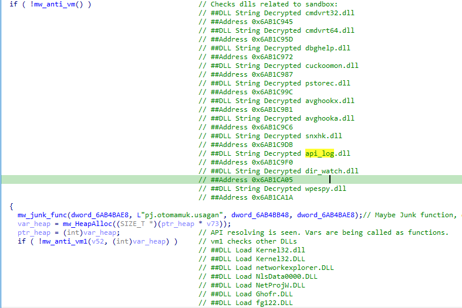

The third anti analysis check, seems to perform some indirect syscalls by finding the address to functions for the ntdll.dll directly. I have not been able to understand this 100% yet.
Also, in this function the only resolved API which is also called is GetTickCount.
This is used to check the time since start of process, also typically used to check if process is running through a debugger.

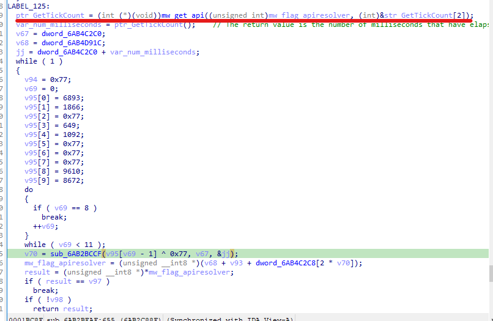
## Core Module Extraction

After the anti-analysis checks, the malware will proceed to fetch the core module from PNG files located in the resource section. 
Each png file has a section of data which needs to be combined with the others. As a delimiter the sample uses a 4 byte string as start of section.
Each section is written to an allocated heap,thus combining them.
In total the sample uses 12 PNG files to store the core module.
The function called has the following arguments:
1. pointer to process
2. PNG file name
3. "png" string extension
4. 4 byte delimiter string
5. Heap offset


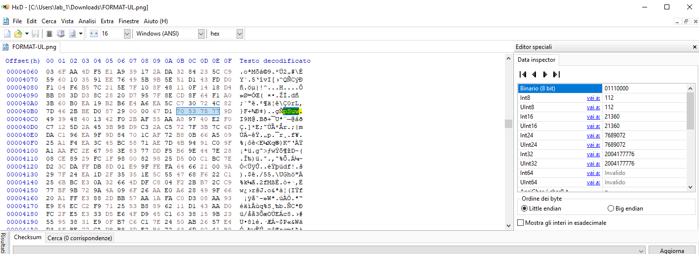

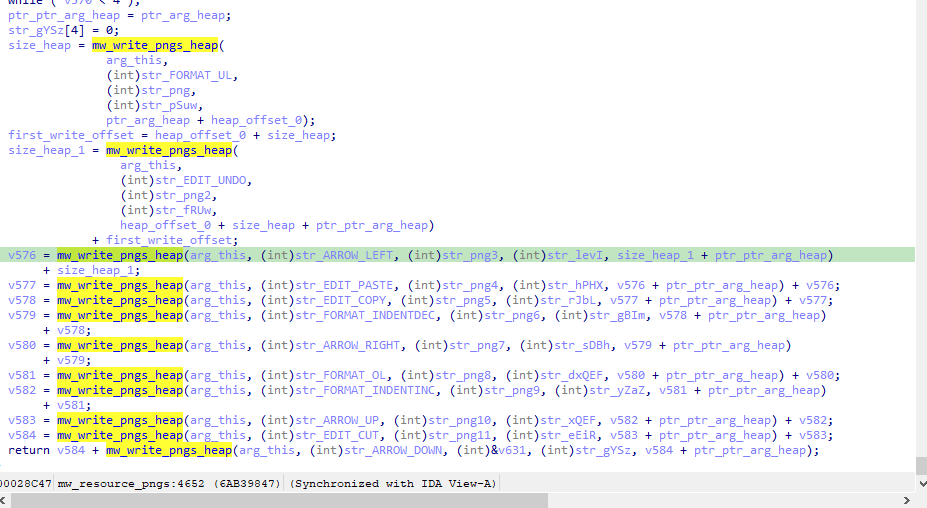

The function called above performs the following:
* Call the API related to resource fetch - FindResourcaA, LoadResourceA, LockResourceA and finally SizeOfResource

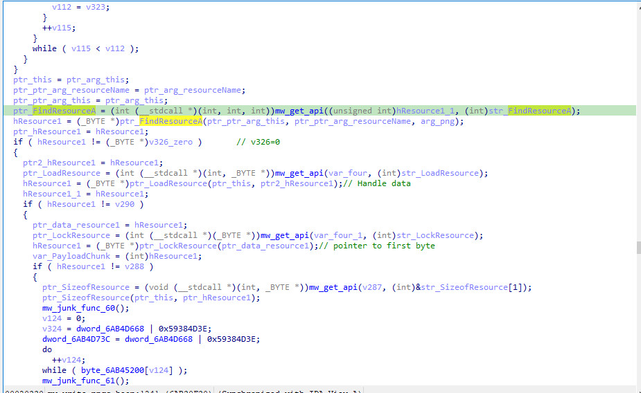

* Once the resource is loaded, the malware parses the PNG chunks and compare the name to the one passed as argument which is a 4 byte string. More on chunks check references, it is how PNG files are structured.
* When the correct chunk is found, all the data from that chuck is written to the allocated heap but it is first xored.

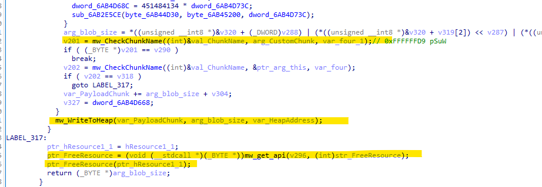

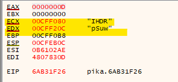
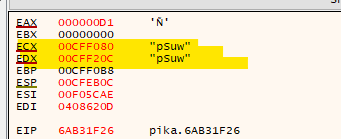


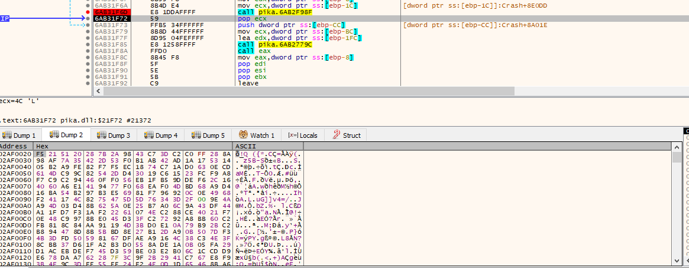


## Core Module Decryption

Once the module is loaded into the heap memory, some more modifications need to be made to change it to a PE file. At the start of the DLL the key is RC4 decrypted:

* 1EmXwEpOYt6Cf8GyJVGXYUaqPnUapVrk

The call to decrypted has the key argument the heap with encrypted payload and new heap which will store the decrypted payload.
The decryption seems to be AES 256, but need to check further.


Finally, once the core module is extracted the final function analyzed calls the following API and injects the code into "SearchProtocolHost.exe", which is spawned in a suspended state.

* InitializeProcThreadAttributeList
* UpdateProcThreadAttribute
* CreateProcessW
* DeleteProcThreadAttribute


Checking process hacker we can observe memory being allocated in the process and then the core payload is written here.


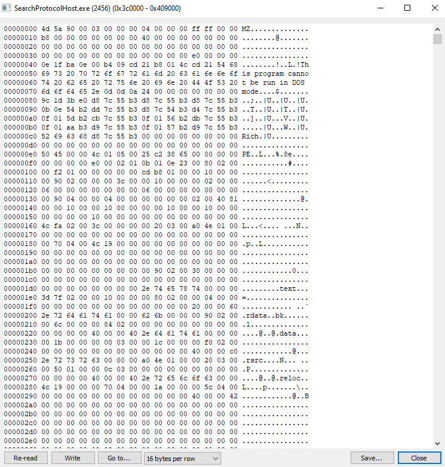
## Indirect Sycalls

As mentioned above, the sample makes use of indirect syscalls. The calls made can be referenced on the eax register by their IDs. I expect NtAllocateVirtualMemory and NtWriteVirtualMemory to be called after process creation.
We can run the code until CreateProcessW is called and then set two breakpoints on the wrapper function for the indirect syscalls. Once inside the syscall id is processed and then called. 
We observe 0x18 and 0x3a being loaded to eax which correspond to the funcitons we expect. Soon after these calls the memory is allocated and the corepayload is written to further evidence the usage of these indirect syscall.


Special thanks to [@xleandr0](https://twitter.com/leandrofr0es) for helping to understand this.


Following the code seen in IDA:


Following the debugger view of the syscall ID:

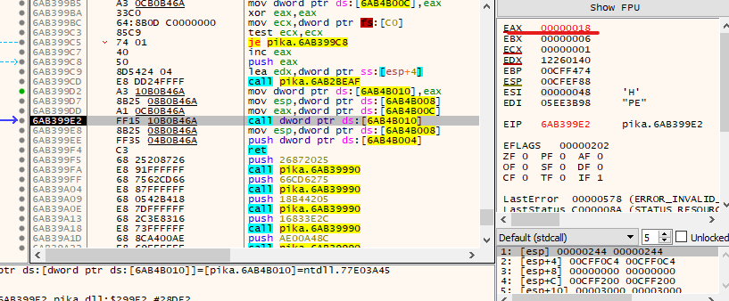


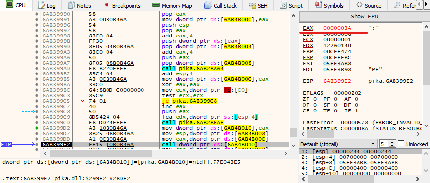

Using conditional breakpoints as above, we can print out all the syscall IDs used by the malware, to see what API are used.
I dumped it all out, but there are a lot of repetitions and can't paste them all here, but the following are the API called without counting duplicates: 
```
##SyscallID 19 -> NtQueryInformationProcess -> NtQueryInformationProcess
INT3 breakpoint at pika.6AB139CF!
##SyscallID 19 -> NtQueryInformationProcess
##SyscallID 3F -> NtReadVirtualMemory 
##SyscallID 2A -> NtUnmapViewOfSection
##SyscallID 18 -> NtAllocateVirtualMemory
##SyscallID 3A -> NtWriteVirtualMemory
##SyscallID 3F -> NtReadVirtualMemory
##SyscallID F3 -> NtGetCurrentProcessorNumber
##SyscallID 52 -> NtResumeThread
```

The breakpoint after NtQueryInformationProcess checks if eax value is 1 or 0. If 1 the process ends, so manually changing the value to 0 avoids the check and continues execution.
Most of the calls that generate volume are:

* NtReadVirtualMemory
* NtAllocateVirtualMemory
* NtWriteVirtualMemory

We can see the final Native API is NtResumeThread which makes sense, since the execution will continue from the injected code.
## References
* https://d01a.github.io/pikabot/
* https://research.openanalysis.net/pikabot/debugging/string%20decryption/emulation/memulator/2023/11/19/new-pikabot-strings.html
* https://www.zscaler.com/blogs/security-research/technical-analysis-pikabot
* https://research.openanalysis.net/pikabot/debugging/string%20decryption/2023/11/12/new-pikabot.html
* https://www.ired.team/offensive-security/code-injection-process-injection/finding-kernel32-base-and-function-addresses-in-shellcode
* http://undocumented.ntinternals.net/index.html?page=UserMode%2FUndocumented%20Functions%2FNT%20Objects%2FProcess%2FPEB.html
* https://www.geoffchappell.com/studies/windows/km/ntoskrnl/inc/api/pebteb/peb/index.htm
* https://www.w3.org/TR/PNG-Chunks.html
* https://0xk4n3ki.github.io/posts/Heavens-Gate-Technique/
* https://www.gosecure.net/blog/2021/12/03/trickbot-leverages-zoom-work-from-home-interview-malspam-heavens-gate-and-spamhaus/
* https://j00ru.vexillium.org/syscalls/nt/64/
* https://twitter.com/leandrofr0es