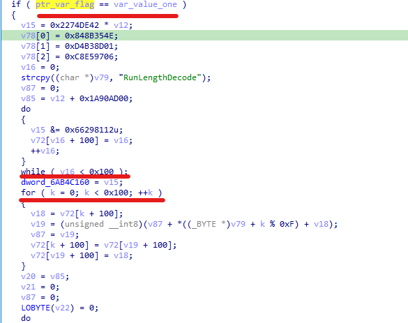
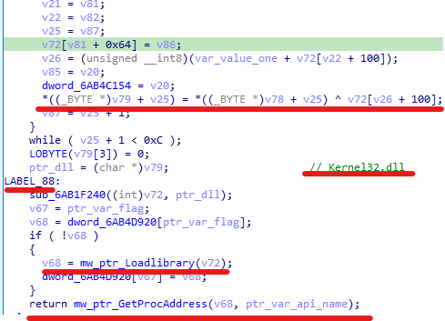
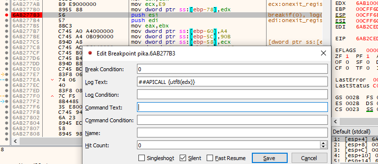

## Sample Information

Packed

| SHA25 | SHA1 | MD5|
|---------|-------|------|
|DBDD22025131EEBE52EFC5FBE70E2E87723FF1934C808901BBB176F6130F23F6 | 66CBE1E120A28E812B265880406305E578560FFF |C859883A3D3889FF159A1DA8A815BD49 
 
Unpacked

| SHA25 | SHA1 | MD5|
|---------|-------|------|
|75CCCAE5F0B726F23DAA6BE69DD7C5E8FCD25A41C06191B84EB00EF945E5F7FA | F269DDFFA7A741C879D712D7009A112402AAA0B2 | 43C7F7F3BDCC56DFDCC02F351E31BCBE

## Introduction

Pikabot is a relatively new malware. It has been analyzed and reversed before ( see references).
This is my take and analysis on the updated version of the loader.
Earlier during the year the sample was smaller and also used different string encryption.
Stack strings are still used, but now RC4 is used to decrypt them.

Pikabot is divided into two modules, the loader and the core.
In this part we will take a look at the loader, which essentially has the job to load the core module which will be responsible for C2 communication.


## High level behavior

So before going into the details the sample will perform the following actions, and during the analysis below I will show case the assembly, decompiler and debugger evidence.

* The malware uses a lot of junk code to try to hinder analysis.
* Accesses the PEB to get handle to kernel32.dll to fetch LoadlLibraryA & GetProcAddress this will be used to dynamically load API.
* Strings, in particular the API names passed to the API resolving function, are encrypted using RC4. 
* The core module is decrypted from png files located in the resource section.


## PEB access

The first function to analyze is the one responsible for fetching LoadlLibraryA  & GetProcAddress. To do this, the malware goes through the PEB to reach to get the base address of the kernel32.dll.

PEB structure is accessed, and the the code walks through InLoadOrderModuleList twice and finally reaches the third entry which is always kernel32.dll.
I have added references below to read more on PEB structure and how it can be used.


Once the module base for kernel32.dll is found, the two API can now be fetched. Two hashes are used and passed to a function which will resolve the API.
* 0xB89FB14B - GetProcAddress
* 0x7FA21D8F - LoadLibraryA


## RC4 Inline Decryption

Checking the sample, it uses RC4 to decrypt the strings. The malware uses "legit" strings for the keystream. We can receognize RC4 by typical  0x100 loops followed by another loop with XOR operation.
Below is what the code looks like.
Keep in mind that the malware uses a lot of junk code between the two loops and final decryption loop.
Also, the decryption happens in line and is not a function.
Both factors make static analysis bothersome, and emulation also bothersome.
The decrypted strings can be fetched all at once using the debugger and some conditional break points. I will add the full list below.
``` 
 do
  {
    v333[v3 + 24] = v3;
    ++v3;
  }
  while ( v3 < 0x100 );
  v4 = 0;
  v338 = 0xF;
  do
  {
    v5 = v333[v4 + 24];
    a1 = (a1 + *(dbg_key_rc4 + (v4 & 0xF)) + v5);
    v333[v4++ + 24] = v333[a1 + 24];
    v333[a1 + 24] = v5;
  }
  while ( v4 < 0x100 );
  v6 = v352;
  jj = 0;
  LOBYTE(v7) = 0;
  for ( i = 0; i < 12; ++i )
  {
    v345 = (v7 + 1);
    v9 = v333[v345 + 24];
    v352 = -339480793 * v6;
    jj = (v9 + jj);
    v333[v345 + 24] = v333[jj + 24];
    v333[jj + 24] = v9;
    v7 = (v7 + 1);
    v6 = v352;
    v312[i] = *(&encrypted_blob[2] + i) ^ v333[(v9 + v333[v7 + 24]) + 24];
  }
```


## Dynamic API resolving

The First analyzed function and the RC4 encryption method, both are the main core of the APi resolving function.
The function accepts two arguements:
* DLL flag -> this is just a numerical value that tells the function in which DLL the API is; 1: Kernel32.dll, 2: User32.dll, 3: ntdll.dll
* API name in cleartext

Whichever dll is used, the end result is always a jump to LABEL 88 seen below which peforms LoadLibraryA and GetProcAddress to retrieve the address of the API.





## Decrypted Strings

Setting two conditional break points on the API resolving function it is possible to have the debugger decrypt all the strings and log them.

* First breakpoint is at the start of the funciton when the decrypted string passed as argument is saved to a variable
* Second breakpoint is on the return, so we can read ESP to also get the return address and so we know on IDA where this value needs to be added as comment and rename functions. 

These are the parameters used for the conditional break point, the addresses refer to how may binary was rebased in IDA.
"##APICALL {utf8(edx)}" -> 0x6AB277B3
"##APICALL Address 0x{[esp]} "-> 0x6AB27F86




Output:
``` 
##APICALL HeapAlloc
##APICALL Address 0x6AB1ECFA
##APICALL LoadLibraryA
##APICALL Address 0x6AB1908A
##APICALL FreeLibrary
##APICALL Address 0x6AB190E3
##APICALL LoadLibraryA
##APICALL Address 0x6AB190FD
##APICALL FreeLibrary
##APICALL Address 0x6AB19246
##APICALL LoadLibraryA
##APICALL Address 0x6AB19260
##APICALL FreeLibrary
##APICALL Address 0x6AB192FA
##APICALL LoadLibraryA
##APICALL Address 0x6AB19314
##APICALL LoadLibraryA
##APICALL Address 0x6AB1950B
##APICALL LoadLibraryA
##APICALL Address 0x6AB1959A
##APICALL GetCurrentProcess
##APICALL Address 0x6AB19D5C
##APICALL GetTickCount
##APICALL Address 0x6AB2C823
##APICALL GetCurrentThread
##APICALL Address 0x6AB1A42C
##APICALL GetThreadContext
##APICALL Address 0x6AB1A44B
##APICALL FindResourceA
##APICALL Address 0x6AB30F35
##APICALL LoadResource
##APICALL Address 0x6AB30F55
##APICALL LockResource
##APICALL Address 0x6AB30F7B
##APICALL SizeofResource
##APICALL Address 0x6AB30F9F
##APICALL FreeResource
##APICALL Address 0x6AB31F8A
##APICALL FindResourceA
##APICALL Address 0x6AB30F35
##APICALL LoadResource
##APICALL Address 0x6AB30F55
##APICALL LockResource
##APICALL Address 0x6AB30F7B
##APICALL SizeofResource
##APICALL Address 0x6AB30F9F
##APICALL FreeResource
##APICALL Address 0x6AB31F8A
##APICALL FindResourceA
##APICALL Address 0x6AB30F35
##APICALL LoadResource
##APICALL Address 0x6AB30F55
##APICALL LockResource
##APICALL Address 0x6AB30F7B
##APICALL SizeofResource
##APICALL Address 0x6AB30F9F
##APICALL FreeResource
##APICALL Address 0x6AB31F8A
##APICALL FindResourceA
##APICALL Address 0x6AB30F35
##APICALL LoadResource
##APICALL Address 0x6AB30F55
##APICALL LockResource
##APICALL Address 0x6AB30F7B
##APICALL SizeofResource
##APICALL Address 0x6AB30F9F
##APICALL FreeResource
##APICALL Address 0x6AB31F8A
##APICALL FindResourceA
##APICALL Address 0x6AB30F35
##APICALL LoadResource
##APICALL Address 0x6AB30F55
##APICALL LockResource
##APICALL Address 0x6AB30F7B
##APICALL SizeofResource
##APICALL Address 0x6AB30F9F
##APICALL FreeResource
##APICALL Address 0x6AB31F8A
##APICALL FindResourceA
##APICALL Address 0x6AB30F35
##APICALL LoadResource
##APICALL Address 0x6AB30F55
##APICALL LockResource
##APICALL Address 0x6AB30F7B
##APICALL SizeofResource
##APICALL Address 0x6AB30F9F
##APICALL FreeResource
##APICALL Address 0x6AB31F8A
##APICALL FindResourceA
##APICALL Address 0x6AB30F35
##APICALL LoadResource
##APICALL Address 0x6AB30F55
##APICALL LockResource
##APICALL Address 0x6AB30F7B
##APICALL SizeofResource
##APICALL Address 0x6AB30F9F
##APICALL FreeResource
##APICALL Address 0x6AB31F8A
##APICALL FindResourceA
##APICALL Address 0x6AB30F35
##APICALL LoadResource
##APICALL Address 0x6AB30F55
##APICALL LockResource
##APICALL Address 0x6AB30F7B
##APICALL SizeofResource
##APICALL Address 0x6AB30F9F
##APICALL FreeResource
##APICALL Address 0x6AB31F8A
##APICALL FindResourceA
##APICALL Address 0x6AB30F35
##APICALL LoadResource
##APICALL Address 0x6AB30F55
##APICALL LockResource
##APICALL Address 0x6AB30F7B
##APICALL SizeofResource
##APICALL Address 0x6AB30F9F
##APICALL FreeResource
##APICALL Address 0x6AB31F8A
##APICALL FindResourceA
##APICALL Address 0x6AB30F35
##APICALL LoadResource
##APICALL Address 0x6AB30F55
##APICALL LockResource
##APICALL Address 0x6AB30F7B
##APICALL SizeofResource
##APICALL Address 0x6AB30F9F
##APICALL FreeResource
##APICALL Address 0x6AB31F8A
##APICALL FindResourceA
##APICALL Address 0x6AB30F35
##APICALL LoadResource
##APICALL Address 0x6AB30F55
##APICALL LockResource
##APICALL Address 0x6AB30F7B
##APICALL SizeofResource
##APICALL Address 0x6AB30F9F
##APICALL FreeResource
##APICALL Address 0x6AB31F8A
##APICALL FindResourceA
##APICALL Address 0x6AB30F35
##APICALL LoadResource
##APICALL Address 0x6AB30F55
##APICALL LockResource
##APICALL Address 0x6AB30F7B
##APICALL SizeofResource
##APICALL Address 0x6AB30F9F
##APICALL FreeResource
##APICALL Address 0x6AB31F8A
##APICALL IsBadReadPtr
##APICALL Address 0x6AB165DE
##APICALL HeapAlloc
##APICALL Address 0x6AB1ECFA
##APICALL HeapFree
##APICALL Address 0x6AB1EFB4
##APICALL InitializeProcThreadAttributeList
##APICALL Address 0x6AB24435
##APICALL HeapAlloc
##APICALL Address 0x6AB1ECFA
##APICALL InitializeProcThreadAttributeList
##APICALL Address 0x6AB24474
##APICALL UpdateProcThreadAttribute
##APICALL Address 0x6AB24541
##APICALL CreateProcessW
##APICALL Address 0x6AB245D5
##APICALL DeleteProcThreadAttributeList
##APICALL Address 0x6AB246D4
##APICALL HeapFree
##APICALL Address 0x6AB1EFB4
##APICALL HeapAlloc
##APICALL Address 0x6AB1ECFA
##APICALL HeapFree
##APICALL Address 0x6AB1EFB4
##APICALL HeapFree
##APICALL Address 0x6AB1EFB4
##APICALL Sleep
##APICALL Address 0x6AB13B32
```


## References
* https://d01a.github.io/pikabot/
* https://research.openanalysis.net/pikabot/debugging/string%20decryption/emulation/memulator/2023/11/19/new-pikabot-strings.html
* https://www.zscaler.com/blogs/security-research/technical-analysis-pikabot
* https://research.openanalysis.net/pikabot/debugging/string%20decryption/2023/11/12/new-pikabot.html
* https://www.ired.team/offensive-security/code-injection-process-injection/finding-kernel32-base-and-function-addresses-in-shellcode
* http://undocumented.ntinternals.net/index.html?page=UserMode%2FUndocumented%20Functions%2FNT%20Objects%2FProcess%2FPEB.html
* https://www.geoffchappell.com/studies/windows/km/ntoskrnl/inc/api/pebteb/peb/index.htm