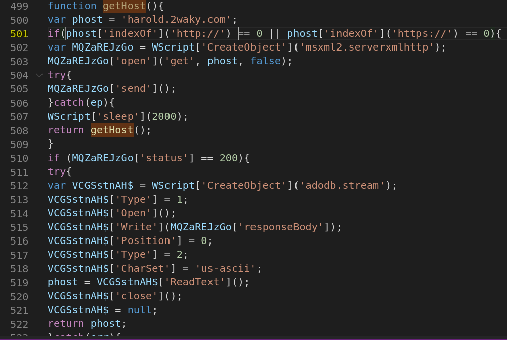
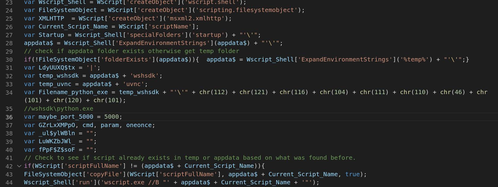
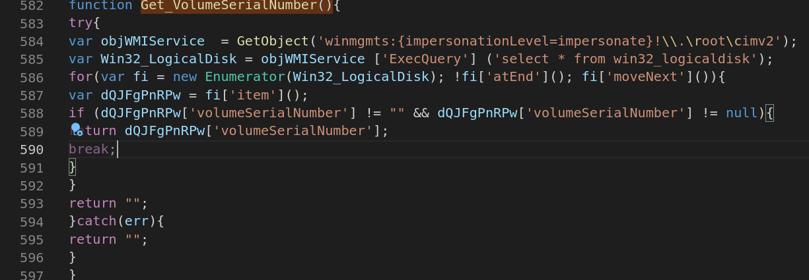
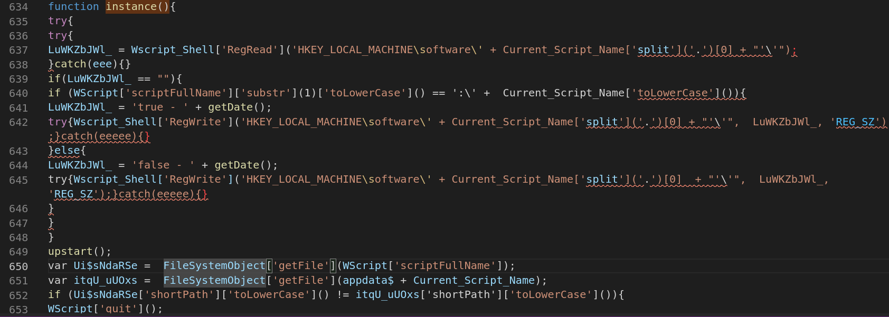

## Part 1

Part one can be found here:
https://github.com/VenzoV/MalwareAnalysisReports/blob/main/WSHRAT/WSHRATpt1.md

## Deobfuscated Second Stage

The first thing the code does is to call and save the return value of getHost().
The function looks like it performs some http requests and such, but if we follow the flow we can see that the first if state will fail since it searches for the index of "https" or "http".
The control flow then passes to line 532 which simply return the variable "phost" which contains the name of the malicious domain.

Next, some variables are set to either true or false, and are likely flags of some kind.
We then have the %appdata% string which is used later in file path operations and also we have the port 3609 stored to a variable.

The script proceeds with a series of checks each one has its own function. 
* Get_VolumeSerialNumber() 
* Priv_Esc() 
* disableSecurity()
* instance()
* upstart()

The malware retrieves the hosts serial number, attempts to run the script with elevated privileges if not so already. If script runs with elevated priviliges it will attempt to disable some security features namely:
* Disable UAC 
* Disable AdminPrompt
* Disable Defender

Following the malware sets up some Wscript objects for internet connection and filesystem manipulation. It proceeds to fetch the script name and checks if appdata folder exists otherwise it gets the temp folder. Inside the folder it finds, it will save a variable "wshsdk\python.exe". Likley some new folder and malicious file it will save pretending to be python.exe. The sample has a few PE files hardcoded so maybe one of them is used later.
The malware also checks if script is already present in appdata or temp (depending on the results of the previous if statement). If it isn't it will copy current script to the location and runs it.

This last functionality is important for the instance() function, where it will check if the script is running from appdata/temp otherwise in quits. So the malware has previously spawned a new process from appdata/temp for this function to work.

The upstart() function for now sets the script to the startup file, likely for persistence.

We then enter a while(true) loop. Interesting to look at the function install().

### Get_VolumeSerialNumber()
Does what function name suggests. Uses WMI object "wingmt"

### Priv_Esc()

This function checks if script is running with elevated privileges, otherwise it tries to run current script as admin.

### disableSecurity()
The next interesting function which has an obvious objective only runs if previous priv_esc() function was successful and script is running with elevated privileges.

The code tries to modify three registry keys which are related to:
* LUA or better known as UAC. This is the windows functionality that notifies user when programs try to make changes to the computer.
* Consent Admin functionality, prompt user for admin credentials
* DisableAntiSpyWare which controls whether Defender Antivirus is on or off.

The malware will try to disable all three.

### Instance()
This function is likely writing the regkey the specific instance of the ran script, and is using the current date as delta.
The reg key written has pattern:
* 'HKEY_LOCAL_MACHINE\SOFTWARE\+SCRIPTNAME+CURRENTDATE'

Another function is called upstart. 
After this it checks to see if it is the instance of the script running from appdata or temp. If it isn't it means it is the original parent process and proceeds to quit.

If malware is in the instance running from second file location, oneonce variable is initialized with the value of a TextStream object. This is used to read,write  or append, kind of like a file handle. The argument 8 (append mode) is passed along with the malicious script written into appdata/temp.

### upstart()

This function is installing persistence. It checks two of the boolean values seen at the start of the code. In our instance for now, only the second check results to true.
Based on which one is true it does one of the following:
* Writes cmd line code to run the script from adppdata/temp in the currentversion\run of HKCU and HKLM registry hive
* Write the script to the startup folder

### install()

The malware begins with checking the drives, in particular drives of type 1 which is removable storage. If it finds one and it has space it will copy the script to the removable storage.
It then checks if the copy was successful by checking if the file exits, if so it will set some attributes 2+4 which I believe are for:
* Hidden
* System

Of this I am not entirely sure yet.
Although both attributes would hide the file, and would make sens if they want the malware to propagate stealthily.

Malware proceeds to loop through the files of the drive it found, checking for files that haven't got the extension 'lnk'. 

## IOC
* harold[.]2waky[.]com

## References 

* https://bazaar.abuse.ch/sample/058c764614c8b0b457852a71ab93b559f81abb9e13b7fc2d6c6a4962881bf062/
* https://learn.microsoft.com/en-us/windows/win32/fileio/file-attribute-constants
* https://en.wikipedia.org/wiki/File_attribute