# Summary part 1

In part one we looked at how shellcode was decrypted by using the Micorsoft Bcrypt library.
AES CBC mode was used to decrypt shellcode located in the file "certificate.pem".
Once this was done a new thread is created and entry point changed to point to the newly decrypted payload allocated within the memory.
We switched threads and followed the shellcode.
# Overview

* Loading bingmaps.dll
* Long busy loop to slow down execution.
* Retrieving once again API via PEB walking 
* Function used to load API from: Kernel32.dll
* Function Used to load native API to perform indirect syscalls: ntdll.dll
* Checks if native calls are hooked.
* New thread is created and execution is switched, the thread points to bingsmap.dll and jumps back and forth to shellcode.
## Loading bingsmap.dll & First Indirect syscall

The shellcode enters firstly into a long loop which takes a bit of time to execute until rcx value is 0x1b1.
This is likely to slowdown analysis or in general to delay execution of malicious code.

PEB reference is fetched and as in part one we enter the code section where it is parsed to fetch export table.
Like part one, it goes through the InMemoryOrderModuleList and compares the result to some chars to get KERNEL32.dll or NTDLL.dll based on what API it needs.
So what we expect is the following:

* loops through all the functions
* Calculates a hash for each one
* Find LoadLibraryA()
* JMP to LoadLibraryA()with "bingmaps.dll" as argument
* Fetching NtProtectVirtualMemory
* Call NtProtectVirtualMemory on bingmaps.dll location with 0x40 rx -> wrx
* Overwrites code of the exported function bingmaps.dll (GetBingsMapFactory). It reads from the shellcode and writes to this location, essentially injecting a part of itself into the legitimate binary. The bytes are xored before writing.

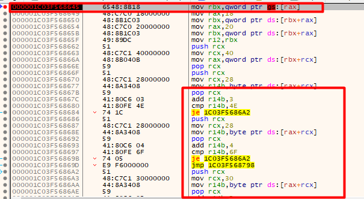

Hashing loop:

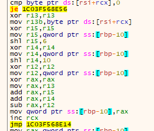

Call to LoadLibraryA:

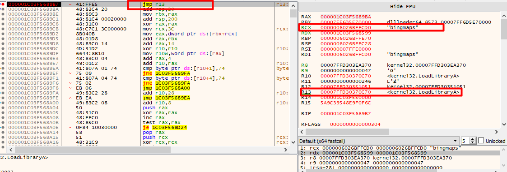

First call to NtProtectVirtualMemory:

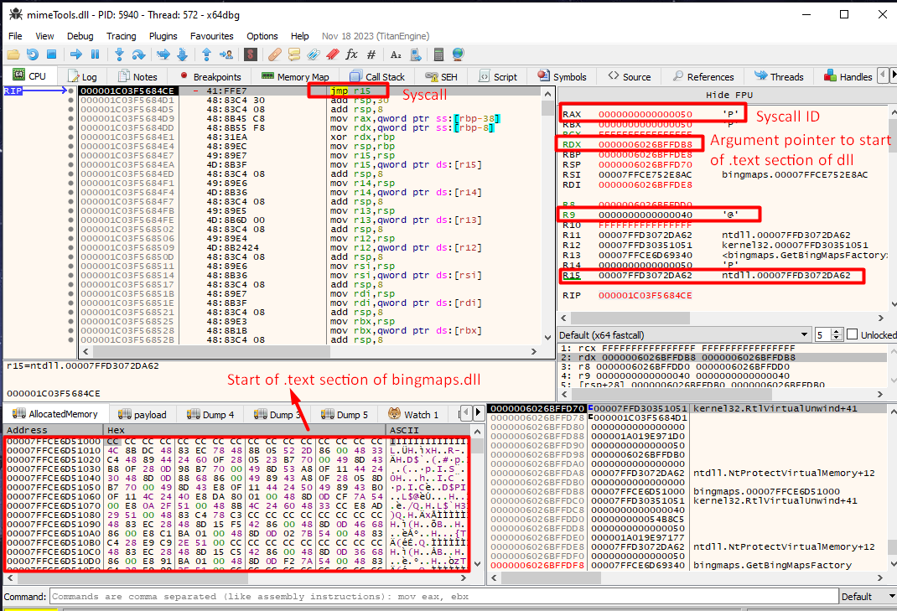

Memory protection alteration:

## Shellcode DLL injection

Next, malware injects part of its shellcode into the exported function of bingmaps.dll GetBingsMapFactory.
Once it has finished injecting code it will call once again NtProtectVirtualMemory with 0x20 PAGE_EXECUTE_READ on the .text section of bingmaps.dll. Reverting it back to RX permissions.

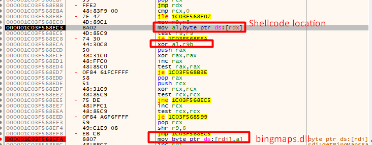

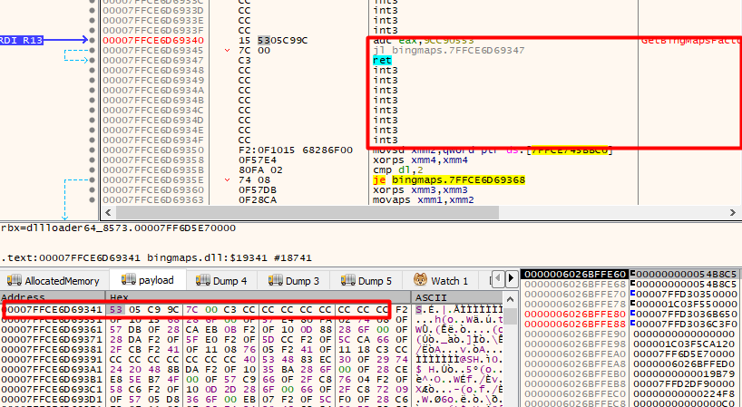

Memory and instructions seen after inject is complete:

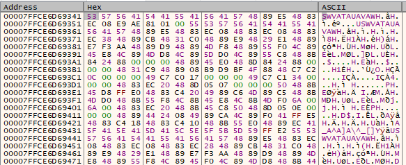

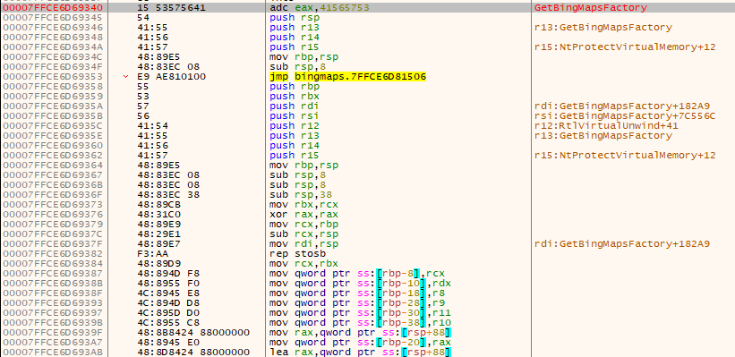
## New thread

Malware will once again run through PEB , Ntdll.dll & Kernel32.dll in search for the following  API:

* GetModuleFileNameA -> This will be the entry point of the new thead, but RIP will be the injected code seen before
* NtCreateThreadEx  -> creates thread in suspended state and hidden from debugger. Value 0x5 we can change it to 0x1 if we want to see the thread in the debugger.
* NtGetContextThread 
* NtSetContextThread -> Inside the context object in memory there is pointer referencing the start of injected code which will be the threads RIP. (BP will be set here to follow execution)
* NtResumeThread 
* NtWaitForSingleObject

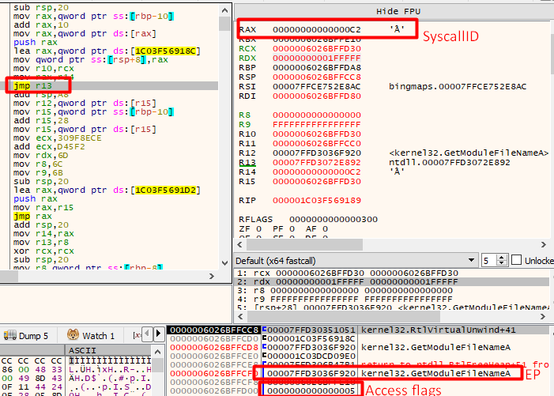

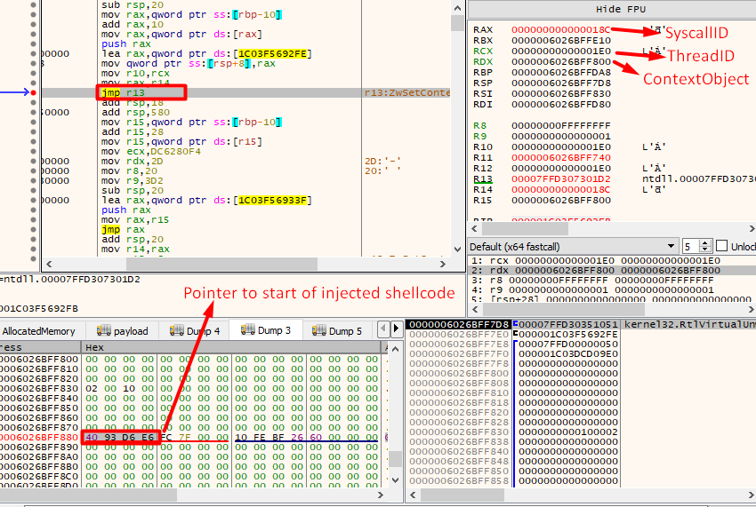

Running execution we finally reach the new thread and code!

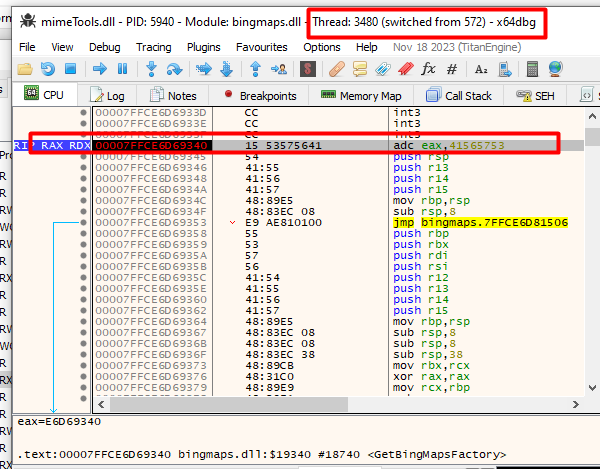

## Anti Debug

From the bingmaps.dll injected code, the malware proceeds with an initial anti debug trick.
It seems it has a hash table hardcoded and checks running processes if they match, if so it proceeds to exit.
For this, from the PEB it fetches the following API:

* CreateToolHelp32SnapShot
* Process32First
* Process32Next

Each name from CreateToolHelp32SnapShot section, is hashed with the same algorithm identified above and then compared with the hashtable results.
I haven't checked all the hashes but for it seems it quit when seeing x64dbg.exe and pe-bear.exe which I had running.

Example hash of Pe-Bear -> C0A4EC617E002F0 -> check performed on 17E002F0 portion.

To avoid this, from Process Hacker I opened the section created by CreateToolHelp32SnapShot and modified the hex values to match svchost.exe, and it worked, we get to the next stage.

Also, worth noting that there is a specific check for explorer.exe, when it matches it runs another section of code that saves the PID of the process. This is needed for the next step.

Hashtable:

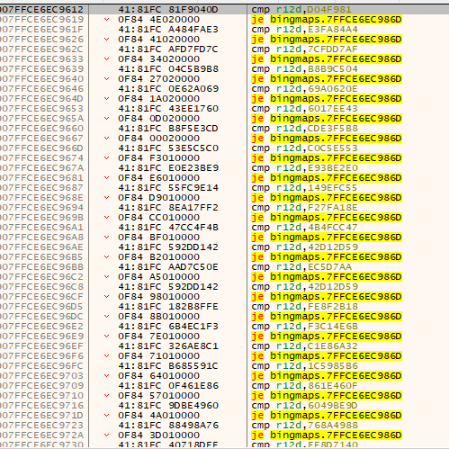

Call to Process32Next:

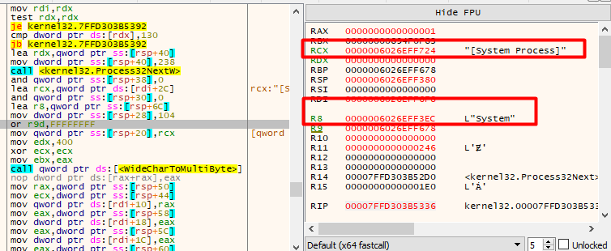

## Injecting 3rd shellcode into explorer.exe

Malware from the context of the bingmaps.dll will now proceed to inject other shellcode to explorer.exe.
To do this the following is done:

* ZwOpenProcess -> supplying the PID of explorer.exe 
* ZwAllocateVirtualMemory -> Allocates two memory buffers inside explorer.exe.
* GetModuleFileA -> Get the full path name of the current process running all the malware
* ZwWriteVirtualMemory -> Writes the shellcoded and the results of GetModuleFileA to explorer.exe section.

For the shellcode, a single byte is written at a time. The byte to write is obtained by a single XOR loop before the call, the result is loaded into R8 which  is the 3rd argument for ZwWriteVirtualMemory.

Call to open process:
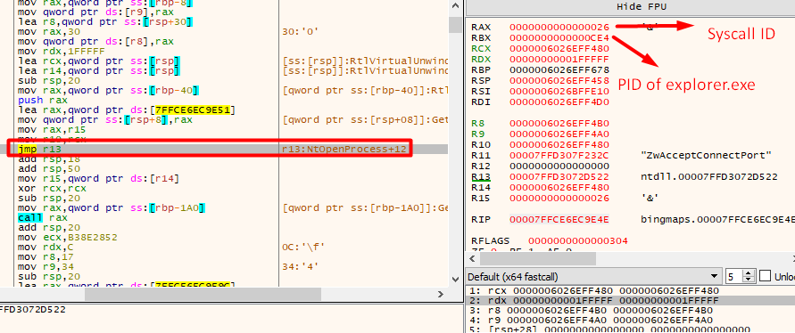

Call to ZwWriteVirtualMemory for current process name:

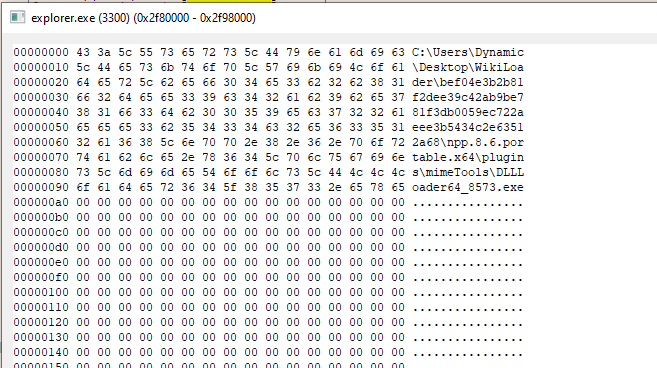

Call to ZwWriteVirtualMemory for shellcode:

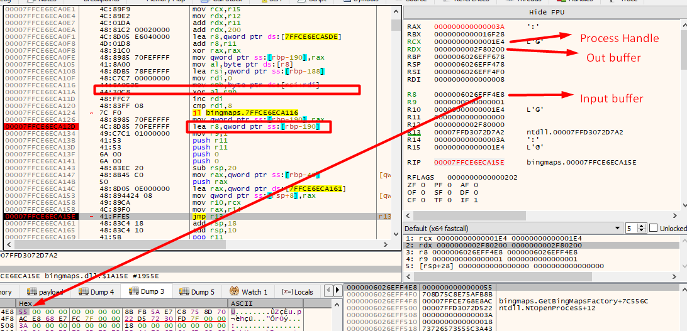

Memory inside explorer.exe after loop write:

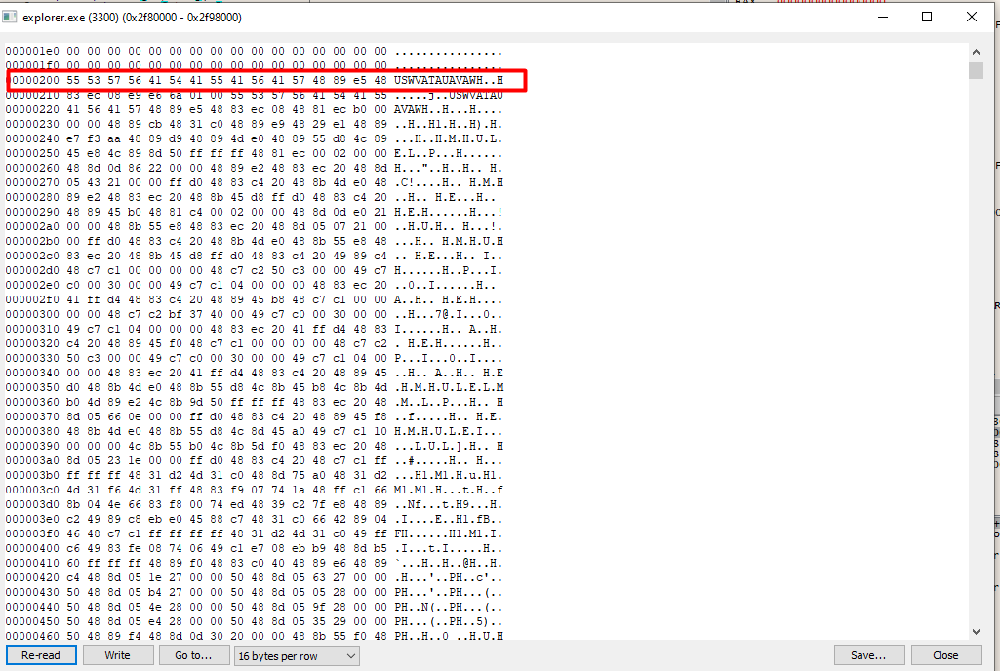

## End of part 2

So we have found another shellcode inject and the code seems to proceed with some other anti analysis checks as I saw it loads:
* ZwQueryInformationProcess
* RtlWow64GetCpuAreaInfo

But I will look into this next time with part 3!

## References

* https://bazaar.abuse.ch/sample/bef04e3b2b81f2dee39c42ab9be781f3db0059ec722aeee3b5434c2e63512a68/
* https://www.unpac.me/results/612d6d2c-c45d-47ba-a2bb-a218ec753d3f
* https://twitter.com/Cryptolaemus1/status/1747394506331160736
* https://www.proofpoint.com/us/blog/threat-insight/out-sandbox-wikiloader-digs-sophisticated-evasion
* https://www.geoffchappell.com/studies/windows/km/ntoskrnl/inc/api/pebteb/peb/index.htm
* https://mohamed-fakroud.gitbook.io/red-teamings-dojo/shellcoding/leveraging-from-pe-parsing-technique-to-write-x86-shellcode