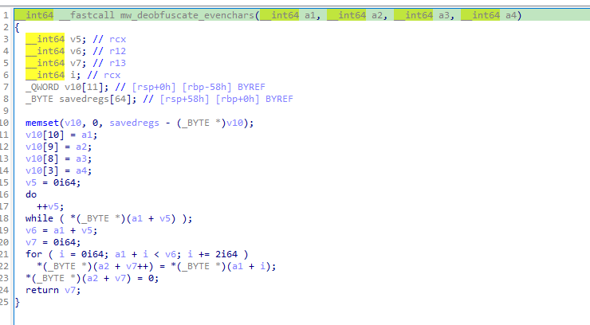
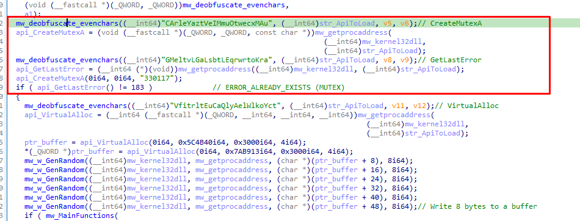
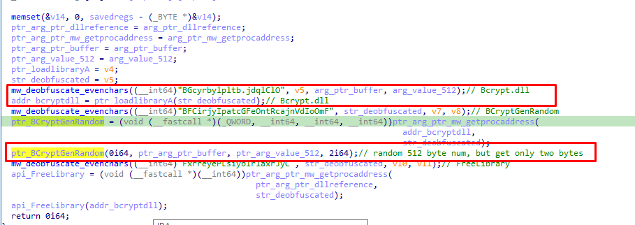
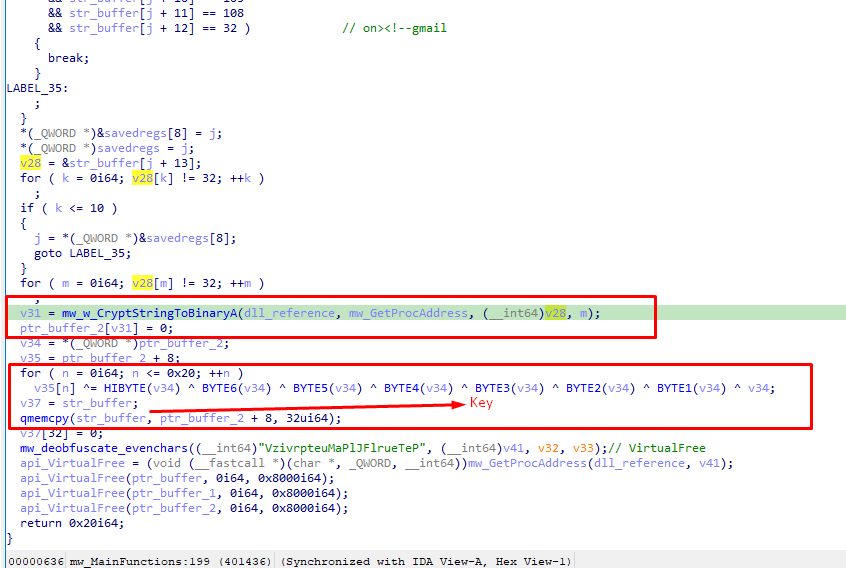

# Summary part 2

* Loading bingmaps.dll
* Long busy loop to slow down execution.
* Retrieving once again API via PEB walking 
* Function used to load API from: Kernel32.dll
* Function Used to load native API to perform indirect syscalls: ntdll.dll
* Checks if native calls are hooked.
* New thread is created and execution is switched, the thread points to bingsmap.dll and jumps back and forth to shellcode.
* Anti analysis checks for common malware analysis tools (x64dbg.exe, pe-bear, process hacker etc.)
* Shellcode is writte into explorer.exe

# Overview

* Overwrites PEB structure
* Creates a mutex 330117
* Dynamically loads API
* Deobfuscation of strings through even positioned characters.
* Gathers system information to send to C2
* C2 requests look for GMAIL tag for extra data (Decryption key)
* Data blob is decrypted and execution is swtiched to new location.
## String "Obfuscation"

The obfuscation is simple and is only based on getting the character sitting in an even position.
So position: 0,2,4,6.. etc




We can easily get the strings and write any python script to deobfuscate them all in one go.

### Strings:

``` 
["WurtirtAenPWrSoycOePsVsDMlewmropruyN",
"DKeiljegtferFDiNlNeBAP",
"VfitrltEuCaQlyAelWlkoYct",
"CCoToCkaiweX:l ejkfikQUwgZ=c7F5I8O8R8F2L1c0W",
"GpeTtPCJogmjpduztBeDriNiaDmretEYxUAG",
"LIoOasdgLsidbnrHagrmyGAS",
"FxrreyePLsiyblrlaxrJyC",
"WginnQiAnyePtc.ldVlslO",
"IKnktjemrinJeJtwOBpeeRnRAC",
"IfnSteeZrEnSeCtmCdoKnZnFetcLtNAw",
"HptHtMprOhpJeEngRfeWqnuKefsotLAx",
"HBtdtyphAudEdVRaeBqBueeTsFtbHnevaPdlebrNsPAs",
"HktLtopzSFeMnmdKRfeNqjuceRsxtDAT",
"HXtNtfpaEknDdvRdeFqbureosMtFAp",
"IDnktseHrhnfegtVRseeaFdpFqiblReN",
"IUnTtveLrcnyeItiCmlroxsSepHsaZngdClJeh",
"MWoLzwijlhlLaN/V5H.D0m a(JLSiqnFuGxa;z GUC;y CAEnadLrYoOiGdF d4s.m0N.h3G;p KeQnS-fgvbN;t jKpFgTYTs QBXuAiklwdH/bIhMPLt7P4YKu)y mAipqpGlIeWWPedbqKkistH/c5U3L7c.S3D6G c(FKzHzTiMLLH,m JlziOkUei gGweecVkEos)M aSHizlmko/C3g.X6i8O slrifkoeU HCNhzryoImFeF/m3v9x.Q0y.s2t1p7k1s.i9L3p HSkaxfTaErFie/q5c3N7P.i3b6z",
"CDrZyypots3E2a.pdLlglp",
"BFCirjyIpatcGFeOntRcajnVdIoOmF",
"BGcyrbylpltb.jdqlClO",
"CWrfyPpjtjSmtSrYiwnzgDTtokBWisnRalrqyXAd",
"CRrnyJpNtYBYiSnOayriypThoGSLtorOimnUgtAI",
"VzivrpteuMaPlJFlrueTeP",
"VYihrItiuTallePbrtottJeYcGtw",
"GYeatsTniAcjkvCOoAuOnWtA6H4w",
"SdlDeneyps",
"GWevtXSiySsEtMeEmyTmicmSej",
"wosCpCrSiVnZtwfNAX",
"GBextkCdosmipYuWtkeiruNnaRmjeoAk",
"GdeltlUJskeHrENeaNmsehAi",
"IDsvUXsueQrcAknZAqdymyicny",
"IzsbWUiXnHdFoxwwsXSRerrVvteart",
"GGeRtrUTsGeJrZDsepfvaRuUlTtjUAItLxaJnxgZujaPgden",
"RNtulSGkeDtiVieSrwsJitornc",
"GMeqthVeegrxsGigoingEWxMAC",
"AwdhvoaVpyiH3u2x.jdKlPly",
"SkhzeElylD3z2Q.wdnlglV",
"UKsoeMrI3Y2L.AdTlmlM",
"330117",
"CArleYaztVeIMmuOtwecxMAu",
"GMeltvLGaLsbtLEqrwrtoKra",
"lrsjtYrwlrejnqAF",
"lusMtZrylUevnAWI",
"BnCerpywpRtIOgpReIniAOlIgLorrUiktLhRmhPyrGonvpibdaeIrc",
"ByCHrpyXpGtzGZettoPRrDoepveUrXttyB",
"BqCzrqyVpRtPSTeQtqPDrboypceerVttyn",
"BOCorbyQpQtgGhevnqewrlaGteekSAykmSmXeGtzrHimciKtedyx",
"BRCprayjpYtaDGeocqrJyipztx",
"BXCarFyJpxtfDuePsvturloqyKKzefyK",
"BwCmruyKpUtDCmlNoosBeAALlKgNoQrHigtKhRmOPSrDoHvciFddeqrJ",
"hgtmtNplst:M/k/WtHhOiWcuhIgmisbNaLnI.UcloVmH/D8DsEjCdwtWuR.Zpkhnpn?oindf=C1C",
"hJtctZpZsa:b/C/OktaGsDhQmDizrewIojrNlSdVwCiXdmeS.ecIoimU/CiblqwK4YkTlp.upnhRpo?EiKdJ=Z1d",
"hVtitUpZsn:T/w/DtJhJeskOoosttNepntfBanmfidlayYsX.ScfoDmX/wmh1HbV7goH3a.ypAhxpE?Eibde=v1r",
"hitZtopwsB:z/t/KmMuBlFtSiotzryaDdieErfsR.nnVehtG/UyqvB7icblFrc.JpLhTpz?AindM=f1j",
"hqtGtOpeso:O/d/PkFaYsPhXmtiqrpwCoDrBladJwNipdieE.zcmoAmn/hialfwf4kkzlw.ypehcpU?ciPdo=J1H",
"hGtutwpPsf:Q/Z/KthhtiQcThigjiQbcaOni.WcHopmL/x8SscjJdGtXuC.kphhupx?xiIdk=C1M",
"hXtYtRpvsV:X/i/WtohBeskDoWsotVednEfkaomkiolayMsy.KcEobmj/Rmt1Ebi7Rou3Z.ipohlpC?liHdw=d1z",
"hOtxtTpxsH:N/O/emDuQlktqiJtnrCaDdMeUrRsr.GnpeGtg/VyQvo7ScllWrV.zpRhcpz?Ziidf=o1g"]


 ```

### Deobfuscated strings:

``` 
WriteProcessMemory
DeleteFileA
VirtualAlloc
Cookie: jfkUg=75888210
GetComputerNameExA
LoadLibraryA
FreeLibrary
Wininet.dll
InternetOpenA
InternetConnectA
HttpOpenRequestA
HttpAddRequestHeadersA
HttpSendRequestA
HttpEndRequestA
InternetReadFile
InternetCloseHandle
Mozilla/5.0 (Linux; U; Android 4.0.3; en-gb; KFTT Build/IML74K) AppleWebKit/537.36 (KHTML, like Gecko) Silk/3.68 like Chrome/39.0.2171.93 Safari/537.36
Crypt32.dll
BCryptGenRandom
Bcrypt.dll
CryptStringToBinaryA
CryptBinaryToStringA
VirtualFree
VirtualProtect
GetTickCount64
Sleep
GetSystemTime
wsprintfA
GetComputerNameA
GetUserNameA
IsUserAnAdmin
IsWindowsServer
GetUserDefaultUILanguage
RtlGetVersion
GetVersionExA
Advapi32.dll
Shell32.dll
User32.dll
301
CreateMutexA
GetLastError
lstrlenA
lstrlenW
BCryptOpenAlgorithmProvider
BCryptGetProperty
BCryptSetProperty
BCryptGenerateSymmetricKey
BCryptDecrypt
BCryptDestroyKey
BCryptCloseAlgorithmProvider
hxxps[://]thichgiban[.]com/8sjdtu[.]php?id=1
hxxps[://]kashmirworldwide[.]com/ilw4kl[.]php?id=1
hxxps[://]thekostenfamilys[.]com/m1b7o3[.]php?id=1
hxxps[://]multitraders[.]net/yv7clr[.]php?id=1
hxxps[://]kashmirworldwide[.]com/ilw4kl[.]php?id=1
hxxps[://]thichgiban[.]com/8sjdtu[.]php?id=1
hxxps[://]thekostenfamilys[.]com/m1b7o3[.]php?id=1
hxxps[://]multitraders[.]net/yv7clr[.]php?id=1

 ```

## Mutex

Using similar method to load API, the malware retrieves GetProcAddress() from the PEB.
It will load CreateMutexA, and attempt to create one with the value:
* 330117
Then it will call GetLastError(), and check for the error code 183 which equates to:

* ERROR_ALREADY_EXISTS



## Host Information Gathering

Inside the Main block of the code, some system checks are performed.
The information gathered is appended into a memory section, in preparation  to be sent out.
Also, with this information a random number is generated of length 48, this is done by loading Bcrypt.dll and calling on BCryptGenRandom()

Following the API called to check system:

* GetComputerNameExA -> Empty so appended "-" to the buffer that has the randomnumber.
* GetComputerNameA -> Appends the computer name
* GetUserNameA
* IsUserAnAdmin -> if user is admin appends a 1 or 0.
* GetUserDefaultUILanguage
* WsprintfA -> Append IsUserAnAdmin & GetUserDefaultUILanguage
* GetSystemTime
* WsprintfA -> Append Systemtime

Memory section containing all the data:


The above function mw_w_GenRandom works as a wrapper function for BCryptGenRandom()



Before moving to network function the string seen above is converted to BASE64 with CryptBinaryToStringA().
Similar to BCryptGenRandom(), this is also located in a wrapper function that loads the .DLL then the function.


## C2 Connection

Malware attempts to connect to the 8 hard-coded URLs and read the page.
This next part is the same as the Proofpoint research mentioned in references.
Basically, the pages contain a tag containing the string "gmail", inside there is another obfuscated URL which contains the next stage payload.
For me at the moment non of the URLs are working and have that tag.


The requests are made to the URLs with cookie Cookie: jfkUg=75888210 + [BASE64 ENCODED SYSTEM DATA]


Currently gmail tags are empty:


## Decryption Routine

After reaching out to C2 there is one other interesting function.
This function seems to load BCrypt.dll and perform some decryption on a large data section contained in the shellcode. 
The same API from BCrypt.dll are called like part 1.
Tracing back from BCryptGenerateSymmetricKey(), it seems the key is actually obtained from results of the URL connections.
If successful, JMP to newly deobfuscted code is made.




## Ending

Unfortunately, I was not able to go further due to not being able to get information needed from the C2.
I will maybe go back or look for other samples going forwards to see the final part.
Mostly all the flow is the same as ProofPoint's analysis referenced below.
Thank you for your time.


## References

* https://bazaar.abuse.ch/sample/bef04e3b2b81f2dee39c42ab9be781f3db0059ec722aeee3b5434c2e63512a68/
* https://www.unpac.me/results/612d6d2c-c45d-47ba-a2bb-a218ec753d3f
* https://twitter.com/Cryptolaemus1/status/1747394506331160736
* https://www.proofpoint.com/us/blog/threat-insight/out-sandbox-wikiloader-digs-sophisticated-evasion
* https://www.geoffchappell.com/studies/windows/km/ntoskrnl/inc/api/pebteb/peb/index.htm
* https://mohamed-fakroud.gitbook.io/red-teamings-dojo/shellcoding/leveraging-from-pe-parsing-technique-to-write-x86-shellcode